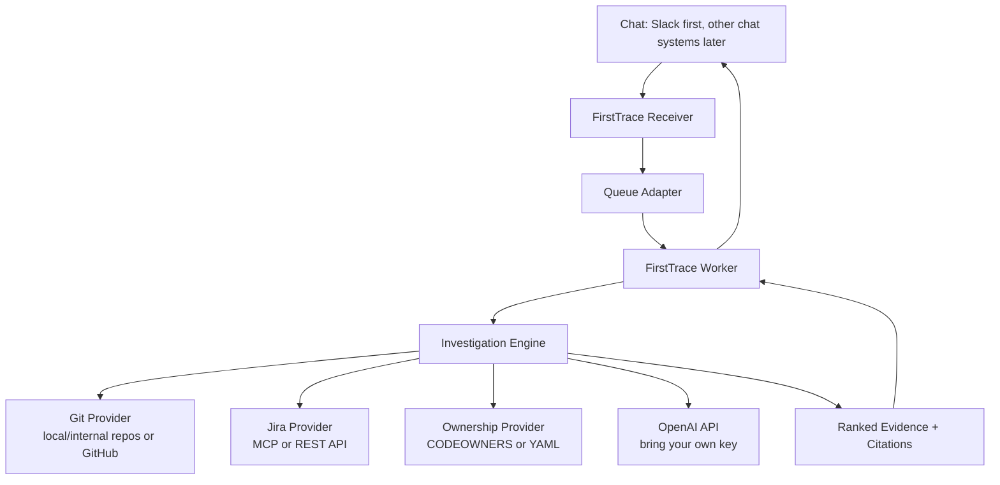

# FirstTrace

Self-hosted bug localization for teams with private, internal, or public git repos.

FirstTrace turns a messy bug report from chat into the first useful evidence trail:
likely component, suspicious files, likely owner, related Jira issues, and suggested
next steps. It is meant to reduce the first hour of debugging, not replace engineers.

## Why

Bug reports usually start in chat:

> Checkout fails after retrying a failed payment. Buyer says the artwork is now held.

The first engineer on the thread then burns time searching code, recent commits,
ownership metadata, and Jira history before they can even ask the right owner for
help. FirstTrace automates that first pass and replies with cited evidence.

## What It Does

The initial version is chat-triggered and read-only:

1. An engineer posts a bug report in a chat channel.
2. They ask `@FirstTrace investigate`.
3. FirstTrace fetches the thread context.
4. It searches configured git repos, Jira, and ownership metadata.
5. It asks an LLM to rank the evidence.
6. It replies in the thread with a concise investigation starting point.

Example output:

```text
Likely component: Checkout / Public Exhibition
Confidence: 0.74

Suspicious files:
1. app/api/public-exhibitions/[slug]/checkout/route.ts
   Reason: owns the checkout start path mentioned in the report.
2. lib/server/checkout/resume-cookie.ts
   Reason: handles retry recovery for held artwork.
3. lib/server/checkout/reconcile-session.ts
   Reason: recent checkout recovery changes touched reconciliation.

Likely owner:
@checkout-platform

Related Jira:
- PAY-18342: checkout retry leaves sale held
- PAY-17920: reconciliation job misses redirected sessions

Suggested next steps:
1. Ask @checkout-platform to inspect retry + held-state handling.
2. Reproduce with a failed payment redirect followed by a second checkout click.
3. Check whether the sale has an open Stripe session before creating a new one.
```

## Architecture



The product is intentionally runtime-portable. The core investigation engine should
not care whether jobs come from Slack, Teams, Discord, a CLI, or a test fixture.

## MVP Scope

FirstTrace v0 should stay small:

- Slack app trigger: `@FirstTrace investigate`
- one or more configured git repositories
- local/internal git support, not only github.com
- optional GitHub provider for public or private GitHub repos
- Jira search via MCP or REST API
- ownership lookup via `CODEOWNERS` or `firsttrace.owners.yaml`
- OpenAI API for ranking and summarization
- thread reply with citations
- eval runner for historical bugs

## Non-Goals

FirstTrace is not:

- an autonomous coding agent
- a ticket-writing system
- a replacement for engineers
- a generic workplace search tool
- a SaaS-only product
- a tool that needs write access to source code

Write permissions, ticket creation, and fix suggestions can come later. The first
product should earn trust by being read-only and evidence-cited.

## Eval-First Development

The key feature is not the Slack integration. The key feature is knowing whether
the answer was useful.

FirstTrace should support historical eval cases:

```yaml
- id: checkout-retry-held-artwork
  report: "Buyer retried checkout after a Stripe redirect failed and the artwork stayed held."
  expected_component: "checkout/public exhibition"
  expected_files:
    - app/api/public-exhibitions/[slug]/checkout/route.ts
    - lib/server/checkout/resume-cookie.ts
    - lib/server/checkout/reconcile-session.ts
  expected_owner: "@checkout-platform"
```

The eval runner should answer:

- Did FirstTrace find the right component?
- Did it include the right owner in the top 3?
- Did it surface useful files?
- Did every claim include evidence?
- Did it avoid confident nonsense?

## Deployment Philosophy

Teams should be able to bring their own infrastructure:

- **Local/dev:** in-memory queue or Redis
- **WallSpace dogfood path:** Vercel receiver + Supabase Queue + worker process
- **Generic open-source path:** Docker Compose + Redis or Postgres
- **Oracle/OCI path:** OCI Container Instances or OKE + OCI Queue + OCI Vault

Queue and runtime should be adapters:

```text
JobQueue
  InMemoryQueue
  RedisQueue
  SupabaseQueue
  VercelQueue
  OciQueue
```

## Initial Dogfood Plan

The first real test corpus can be a private repo with known historical bugs. For
example, a local app repo can provide old bug reports with known final files and
owners. If FirstTrace cannot localize those bugs from git history and ownership
metadata, chat integration will not save it.

## Status

Idea stage. The next step is a small spike:

1. Implement a CLI-only investigation flow against a local git repo.
2. Add ownership YAML support.
3. Add a simple eval file format.
4. Run against 5-10 historical bugs.
5. Only then wire Slack.

## License

TBD.
