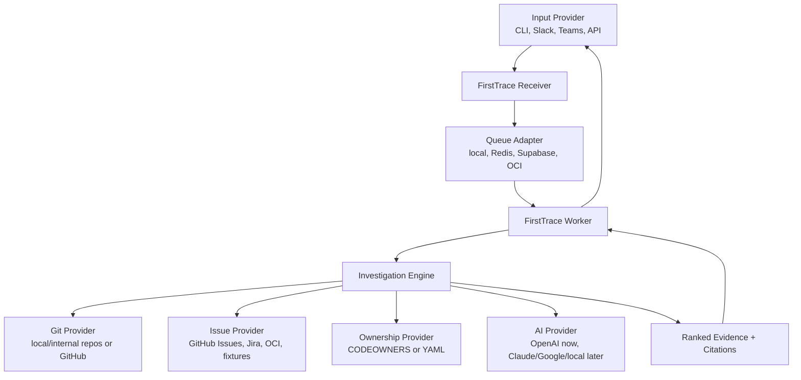

# FirstTrace

Self-hosted bug localization for teams with private, internal, or public git repos.

FirstTrace turns a messy bug report from chat, CLI, or another source into the
first useful evidence trail: likely component, suspicious files, likely owner,
related issues, and suggested next steps. It is meant to reduce the first hour
of debugging, not replace engineers.

## Why

Bug reports usually start in chat:

> Checkout fails after retrying a failed payment. Buyer says the artwork is now held.

The first engineer on the thread then burns time searching code, recent commits,
ownership metadata, and Jira history before they can even ask the right owner for
help. FirstTrace automates that first pass and replies with cited evidence.

## What It Does

The current version is read-only:

1. An engineer runs `firsttrace investigate` with a bug report and config file.
2. FirstTrace prepares configured repositories, including local checkouts or
   read-only GitHub App materialized repositories.
3. FirstTrace searches files, docs, issue exports, and recent git commits.
4. It classifies the report, ranks likely evidence, maps owners, and prints a
   concise investigation starting point with citations.
5. The same investigation path can run through local evals or the local worker
   queue under `.firsttrace/jobs`.

The later channel-agent version is chat-triggered:

1. An engineer posts a bug report in a chat channel.
2. They ask `@FirstTrace investigate`.
3. FirstTrace fetches the thread context.
4. It searches configured git repos, Jira, and ownership metadata.
5. It asks an LLM to rank the evidence.
6. It replies in the thread with a concise investigation starting point.

Example output:

```text
Likely component: Checkout / Public Exhibition
Confidence: 0.74

Suspicious files:
1. app/api/public-exhibitions/[slug]/checkout/route.ts
   Reason: owns the checkout start path mentioned in the report.
2. lib/server/checkout/resume-cookie.ts
   Reason: handles retry recovery for held artwork.
3. lib/server/checkout/reconcile-session.ts
   Reason: recent checkout recovery changes touched reconciliation.

Likely owner:
@checkout-platform

Related Jira:
- PAY-18342: checkout retry leaves sale held
- PAY-17920: reconciliation job misses redirected sessions

Suggested next steps:
1. Ask @checkout-platform to inspect retry + held-state handling.
2. Reproduce with a failed payment redirect followed by a second checkout click.
3. Check whether the sale has an open Stripe session before creating a new one.
```

## Architecture



The product is intentionally runtime-portable. The core investigation engine should
not care whether jobs come from Slack, Teams, Discord, a CLI, or a test fixture,
and it should not care whether AI reasoning comes from OpenAI, Claude, Google AI,
or a local model.

## Product Plan

See [docs/PRODUCT_PLAN.md](docs/PRODUCT_PLAN.md) for the working build plan,
core architecture, eval strategy, runtime adapter strategy, and open questions.
See [implement.md](implement.md) for implementation guidance meant for future
engineering sessions.
See [instructions.md](instructions.md) for the planned hosted setup workflow for
companies that want FirstTrace connected to a private GitHub repo and a Slack
triage channel.

## Local CLI

Install the packaged CLI when you want to use FirstTrace from another project or
deployment wrapper:

```bash
npm install -g firsttrace
```

When working from this source checkout, run `npm install` first and use
`npm run firsttrace -- ...` as the development equivalent of the `firsttrace`
commands below.

The CLI supports deterministic investigation, optional AI reasoning,
evals, a local worker runtime, a local `submit` message adapter, hosted queue
selection for Supabase-backed jobs, and GitHub App-backed repository
materialization. The hosted API also includes a Slack Events receiver that can
verify Slack signatures, gate events by configured channel and trigger, enqueue
jobs, and post worker results back to Slack threads when `SLACK_BOT_TOKEN` is
configured. The hosted verification runner can exercise that receiver -> queue
-> worker -> notifier path locally before real Slack, GitHub, and Supabase
credentials are ready.
The CLI always gathers deterministic evidence first. OpenAI is only called when
`--ai` is passed. By default, `--ai` runs the read-only FirstTrace investigation
agent with `OPENAI_MODEL_CHAT=gpt-5.4-mini`; set `FIRSTTRACE_INVESTIGATOR=evidence`
to use the older one-shot evidence-bundle reasoner. `FIRSTTRACE_INVESTIGATOR=codex-cli`
is reserved for a later adapter and is not implemented yet.

```bash
firsttrace investigate \
  --config firsttrace.config.yaml \
  --report "README deployment plan is unclear"
```

Optional AI-assisted run:

```bash
cp .env.example .env.local
# Fill in OPENAI_API_KEY in .env.local.
firsttrace investigate \
  --config firsttrace.config.yaml \
  --report "README deployment plan is unclear" \
  --ai
```

Eval run:

```bash
firsttrace eval \
  --config firsttrace.config.yaml \
  --cases evals/example.yaml
```

Local submit and worker run:

```bash
firsttrace submit \
  --queue filesystem \
  --config firsttrace.config.yaml \
  --report "README deployment plan is unclear"

firsttrace worker run --once --queue filesystem

firsttrace worker status --queue filesystem --job <job-id>
```

`worker enqueue` is the lower-level queue command. `submit` is the local
message-delivery path that future chat and HTTP adapters should mirror.

Supabase-backed queue run:

```bash
firsttrace submit \
  --queue supabase \
  --config firsttrace.config.yaml \
  --report "README deployment plan is unclear"

firsttrace worker run --once --queue supabase

firsttrace worker status --queue supabase --job <job-id>
```

Supabase requires `SUPABASE_URL` and `SUPABASE_SERVICE_ROLE_KEY`. The hosted
receiver defaults to the Supabase queue and exposes `POST /api/investigations`
plus `GET /api/jobs?id=<job-id>`. Those generic HTTP endpoints require
`FIRSTTRACE_RECEIVER_TOKEN` by default. Set
`FIRSTTRACE_ALLOW_UNAUTHENTICATED_RECEIVER=true` only for local development
when you intentionally want to test them without bearer auth.

GitHub App-backed repo config:

```yaml
repos:
  - name: example-app
    provider: github
    owner: exampleco
    repo: web-app
    default_branch: main
docs:
  - README.md
  - docs
issue_exports: []
owners:
  - path: app/**
    owner: "@frontend-platform"
search:
  max_files: 10
  max_commits: 8
  max_evidence_per_file: 3
```

GitHub repos should use a read-only GitHub App installation for hosted or shared
production environments:

```bash
GITHUB_APP_ID=
GITHUB_APP_INSTALLATION_ID=
GITHUB_APP_PRIVATE_KEY=
```

For a local validation run, `GITHUB_TOKEN` can be used instead of a GitHub App. A
token from `gh auth token` works if that account has read access to the target
repository. Prefer the GitHub App path for hosted deployments because it can be
installed only on the repositories FirstTrace is allowed to inspect.

```bash
GITHUB_TOKEN=
```

FirstTrace creates or reads a runtime token, clones or fetches with a
one-command HTTP auth header, and stores the working cache under ignored
`.firsttrace/github/`. Tokens are not embedded in the remote URL or git config.

Slack channel config:

```yaml
chat:
  provider: slack
  channels:
    - id: C0123456789
      name: company-ai-triage
      triggers:
        - message
        - app_mention
        - reaction
      response: thread
      ai_enabled: true
      repositories:
        - example-app
```

The Slack endpoint is:

```text
POST /api/slack/events
```

Slack requires these environment variables:

```bash
SLACK_BOT_TOKEN=
SLACK_SIGNING_SECRET=
```

Slack Events requests are deduped by team, trigger, channel, source message
timestamp, and reaction name when applicable, so Slack retries return the
existing queued job instead of creating duplicate investigations.

Hosted readiness verification:

```bash
firsttrace hosted verify \
  --config examples/hosted.local.config.yaml \
  --queue filesystem \
  --report "README deployment plan is unclear"
```

The command uses a synthetic signed Slack event and a fake Slack notifier by
default. Add `--live-slack-post` only when a real `SLACK_BOT_TOKEN` and
configured Slack channel are available.

## Hosted Deployment Setup

Use this sequence to connect the full hosted path:

1. Create or choose a Slack triage channel and note the channel id.
2. Create a Slack app with `chat:write`, `channels:read`, `channels:history`,
   `app_mentions:read`, and `reactions:read`; use `groups:read` and
   `groups:history` too if the channel is private.
3. Install the Slack app, copy `SLACK_BOT_TOKEN` and `SLACK_SIGNING_SECRET`,
   and invite the bot to the triage channel.
4. Create a Supabase project and apply every file in `supabase/migrations/` in
   order, including the dedupe migration.
5. Store `SUPABASE_URL`, `SUPABASE_SERVICE_ROLE_KEY`,
   `FIRSTTRACE_QUEUE_PROVIDER=supabase`, `FIRSTTRACE_RECEIVER_TOKEN`, and
   `FIRSTTRACE_ALLOW_UNAUTHENTICATED_RECEIVER=false`.
6. Configure repositories with either a read-only GitHub App
   (`GITHUB_APP_ID`, `GITHUB_APP_INSTALLATION_ID`, `GITHUB_APP_PRIVATE_KEY`) or
   local validation `GITHUB_TOKEN`.
7. Run `hosted verify` locally with `--queue supabase`; add
   `--live-slack-post` after Slack env is present.
8. Deploy the API to a public HTTPS host. On Vercel, the Slack endpoint can use
   background processing to run one worker pass after Slack has been
   acknowledged. Keep the protected worker endpoint,
   `GET|POST /api/worker/run-once`, available for manual repair runs or
   cron on plans that support the desired frequency.
9. Set Slack Event Subscriptions to
   `https://<host>/api/slack/events`.

Vercel is not required for local end-to-end verification. It is needed only when
Slack itself must call the public `/api/slack/events` endpoint. Vercel worker
runs use `/tmp/firsttrace/github` by default for GitHub materialization because
the deployed function directory is read-only.

## OCI Deployment

FirstTrace also ships a production OCI deployment path under
[`deploy/oci`](deploy/oci). It uses Terraform/OCI Resource Manager to create OCI
Queue, Object Storage runtime markers, Vault/KMS, OCIR, Container Instances, API
Gateway, and IAM policies. The same image runs a receiver container and a worker
container. The OCI image should be built with `deploy/oci/Dockerfile.package`,
which installs the packed `firsttrace` npm package and copies only the deployment
config into the image.

The OCI runtime is selected with:

```bash
FIRSTTRACE_QUEUE_PROVIDER=oci
```

Runtime secrets should be stored in OCI Vault, not Terraform state. After the
Terraform stack creates Vault/KMS, run:

```bash
firsttrace-oci-sync-secrets
```

Then set the Slack app Event Subscription request URL to the Terraform
`slack_events_url` output. See [deploy/oci/README.md](deploy/oci/README.md) for
the full reusable deployment sequence.

## MVP Scope

FirstTrace v0 should stay small:

- chat provider trigger, with Slack first and Teams or other providers later
- one or more configured git repositories
- local/internal git support, not only github.com
- optional GitHub provider for public or private GitHub repos
- issue/work-item provider support for GitHub Issues, Jira, OCI, or fixtures
- ownership lookup via `CODEOWNERS` or `firsttrace.owners.yaml`
- investigator provider support, with OpenAI-backed `agent` mode first
- thread reply with citations
- eval runner for historical bugs

## Non-Goals

FirstTrace is not:

- an autonomous code-writing or code-fixing agent
- a ticket-writing system
- a replacement for engineers
- a generic workplace search tool
- a SaaS-only product
- a tool that needs write access to source code

Write permissions, ticket creation, and fix suggestions can come later. The first
product should earn trust by being read-only and evidence-cited.

## Eval-First Development

The key feature is not the Slack integration. The key feature is knowing whether
the answer was useful.

FirstTrace should support historical eval cases:

```yaml
- id: checkout-retry-held-artwork
  report: "Buyer retried checkout after a Stripe redirect failed and the artwork stayed held."
  expected_component: "checkout/public exhibition"
  expected_files:
    - app/api/public-exhibitions/[slug]/checkout/route.ts
    - lib/server/checkout/resume-cookie.ts
    - lib/server/checkout/reconcile-session.ts
  expected_owner: "@checkout-platform"
```

The eval runner should answer:

- Did FirstTrace find the right component?
- Did it include the right owner in the top 3?
- Did it surface useful files?
- Did every claim include evidence?
- Did it avoid confident nonsense?

## Deployment Philosophy

Teams should be able to bring their own infrastructure:

- **Local/dev:** in-memory queue or Redis
- **Vercel/Supabase path:** Vercel receiver + Supabase Queue + worker process
- **Generic open-source path:** Docker Compose + Redis or Postgres
- **OCI path:** OCI Container Instances or OKE + OCI Queue + OCI Vault. The
  recommended OCI runtime is a Docker/OCI image that installs the `firsttrace`
  npm package, not a full source checkout.

Queue and runtime should be adapters:

```text
JobQueue
  InMemoryQueue
  FileSystemQueue
  SupabaseQueue
  RedisQueue
  VercelQueue
  OciQueue
```

## Initial Product Validation Plan

The first real test corpus can be any private repo with known historical bugs,
expected files, and expected owners. If FirstTrace cannot localize those bugs
from git history and ownership metadata, chat integration will not save it.

## Status

Phase 9A local CLI, eval runner, worker runtime, local submit adapter,
Supabase-backed queue, Vercel-compatible receiver/status handlers, and GitHub
App-backed repository materialization, Slack event intake, and Slack result
notification, plus hosted readiness verification are implemented. The
deterministic command is:

```bash
firsttrace investigate \
  --config firsttrace.config.yaml \
  --report "README deployment plan is unclear"
```

The AI-assisted command is:

```bash
firsttrace investigate \
  --config firsttrace.config.yaml \
  --report "README deployment plan is unclear" \
  --ai
```

The eval command is:

```bash
firsttrace eval \
  --config firsttrace.config.yaml \
  --cases evals/example.yaml
```

The local submit and worker command sequence is:

```bash
firsttrace submit \
  --queue filesystem \
  --config firsttrace.config.yaml \
  --report "README deployment plan is unclear"

firsttrace worker run --once --queue filesystem

firsttrace worker status --queue filesystem --job <job-id>
```

The hosted readiness command is:

```bash
firsttrace hosted verify \
  --config examples/hosted.local.config.yaml \
  --queue filesystem \
  --report "README deployment plan is unclear"
```

Next planned work:

1. Run the live hosted deployment flow with real Slack, GitHub App, Supabase, and AI.
2. Add GitHub Issues or another issue provider through the generic provider boundary.

## License

Apache License 2.0.
