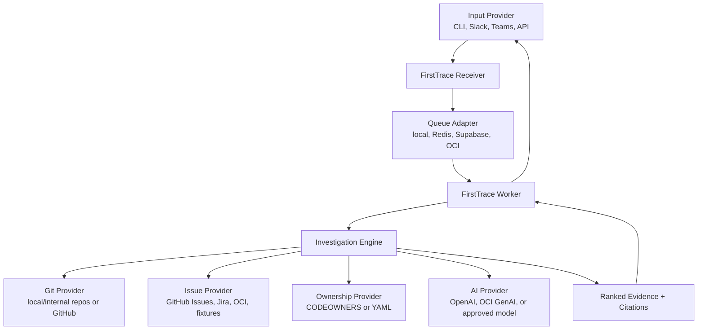

# FirstTrace

Self-hosted manager-owner bug triage for teams with private, internal, or public
git repos.

FirstTrace turns a messy bug report from chat, CLI, or another source into a
PM/manager-facing triage handoff: the user-facing issue, one or two
evidence-backed owner candidates, the exact code and commit evidence behind each
candidate, likely root cause, user impact, and recommended manager action.

Engineers can use Codex or other AI/code tools later to debug and implement the
fix. FirstTrace's primary job is to make the first assignment and escalation
decision evidence-based.

## Why

Bug reports usually start in chat:

> Checkout fails after retrying a failed payment. Buyer says the artwork is now held.

The first PM or manager on the thread needs to know what users are experiencing,
which person should be asked first, and whether that assignment is backed by
real code and change-history evidence. FirstTrace automates that first pass and
refuses to invent a person owner when the evidence is missing.

## What It Does

The current version is read-only:

1. A PM, manager, or operator runs `firsttrace investigate` with a bug report
   and config file.
2. FirstTrace prepares configured repositories, including local checkouts or
   read-only GitHub App materialized repositories.
3. FirstTrace searches files, docs, issue exports, and recent git commits.
4. It classifies the report, ranks likely evidence, maps owner metadata, and
   prints a concise cited triage result.
5. The same investigation path can run through local evals or the local worker
   queue under `.firsttrace/jobs`.

Current releases make `manager-owner-triage` the default bug-report response
contract. That means a stable manager Markdown reply from validated JSON, no
customer-specific prompt overlay required.

The hosted channel version is chat-triggered:

1. A PM, manager, support lead, or engineer posts a bug report in a chat
   channel.
2. They ask `@FirstTrace investigate`.
3. FirstTrace fetches the thread context.
4. It searches configured git repos and ownership/change-history metadata.
5. It asks an LLM to rank and explain only the gathered evidence.
6. It replies in the thread with manager-readable owner candidates, evidence,
   likely root cause, user impact, and recommended action.

Example output:

```text
Bug Triage

Issue
Entity detail links can fail when an entity ID contains "/", for example
ACME/123. The UI builds a route with the raw ID, so the router treats the slash
as a path separator.

Likely Owner Candidate

1. Dev Owner
   Email: dev.owner@example.com
   Confidence: High
   Reason: Exact line blame points to the commit that inserted the raw ID into
   the route path.
   Evidence source: exact_line_blame

   Evidence commits:
   - Commit: 0123456789abcdef0123456789abcdef01234567
     Commit time: 2026-05-20T17:15:30Z
     Commit title: Add entity detail links
     Repo: web-app
     File: src/components/EntityLinks.tsx
     Line: 42
     Evidence: navigate(`/entities/${entity.id}/detail`)
     Why relevant: This inserts a slash-containing entity ID directly into the
     route path.

Likely Root Cause
Entity IDs containing reserved URL characters are inserted directly into route
paths instead of being encoded or routed through a safe path helper.

User Impact
Users cannot reliably navigate from lists, alerts, or dashboards to affected
entity detail pages.

Recommended Manager Action
Route first to Dev Owner because exact code and commit evidence points to that
person. Ask the implementer to verify route encoding and update adjacent links
using the same pattern.
```

If FirstTrace cannot find person-level evidence, the manager action should be
explicitly non-assignment:

```text
Recommended Manager Action
Do not assign a person yet. Collect Git blame, commit history, PR metadata, or
provider pushed-by metadata for the suspected files.
```

## Architecture


```mermaid
flowchart TD
  Chat["Input Provider<br/>CLI, Slack, Teams, API"] --> Receiver["FirstTrace Receiver"]
  Receiver --> Queue["Queue Adapter<br/>local, Redis, Supabase, OCI"]
  Queue --> Worker["FirstTrace Worker"]

  Worker --> Agent["Investigation Engine"]
  Agent --> Git["Git Provider<br/>local/internal repos or GitHub"]
  Agent --> Issues["Issue Provider<br/>GitHub Issues, Jira, OCI, fixtures"]
  Agent --> Owners["Ownership Provider<br/>CODEOWNERS or YAML"]
  Agent --> AI["AI Provider<br/>OpenAI, OCI GenAI, or approved model"]

  Agent --> Evidence["Ranked Evidence + Citations"]
  Evidence --> Worker
  Worker --> Chat
```

The product is intentionally runtime-portable. The core investigation engine should
not care whether jobs come from Slack, Teams, Discord, a CLI, or a test fixture,
and it should not care whether AI reasoning comes from direct OpenAI, OCI GenAI,
Claude, Google AI, or a local model.

Current runtime backend support:

- **Vercel/Supabase:** Vercel-compatible HTTP handlers with Supabase-backed job
  storage and worker processing.
- **OCI:** OCI API Gateway or another HTTPS front door, OCI Container Instances,
  OCI Queue, Object Storage runtime markers, OCI Vault/KMS, and OCIR package
  images.
- **Local/dev:** filesystem queue and local worker loop for development,
  verification, and evals.

## Product Plan

See [docs/PRODUCT_PLAN.md](docs/PRODUCT_PLAN.md) for the working build plan,
core architecture, eval strategy, runtime adapter strategy, and the next-version
manager-owner triage milestones requested by the current customer.
See [implement.md](implement.md) for implementation guidance meant for future
engineering sessions.
See [instructions.md](instructions.md) for the npm-first hosted setup workflow
for companies that want FirstTrace connected to a private GitHub repo and a
Slack triage channel. That guide focuses on the Vercel/Supabase path; the OCI
deployment guide lives under [deploy/oci](deploy/oci).

## Install As A Dependency

For an external project or deployment wrapper, install FirstTrace from npm:

```bash
npm install firsttrace@0.1.7
```

The package provides:

- CLI: `firsttrace`
- standalone HTTP receiver: `firsttrace-http`
- standalone worker loop: `firsttrace-worker`
- OCI Vault secret sync: `firsttrace-oci-sync-secrets`
- Vercel route exports and deployment templates for npm-wrapper deployments
- OCI deployment templates for package-based container deployments

Vercel/Supabase users create a small operations wrapper and copy the packaged
template:

```bash
mkdir firsttrace-vercel
cd firsttrace-vercel
npm init -y
npm install firsttrace@0.1.7
cp -R node_modules/firsttrace/deploy/vercel/* .
cp node_modules/firsttrace/deploy/vercel/gitignore.template .gitignore
npm install
```

The wrapper imports only from the published `firsttrace` package. Apply the
packaged Supabase migrations with the Supabase CLI, apply the packaged Vercel
Terraform, deploy with `npx vercel@latest --prod`, and run:

```bash
npx firsttrace hosted accept --backend vercel-supabase ...
```

OCI users copy the OCI deployment template from the package:

```bash
cp -R node_modules/firsttrace/deploy/oci ./deploy/oci
```

The npm-based OCI path has been validated from a clean operations directory:
install the package, copy `node_modules/firsttrace/deploy/oci`, provision OCI
with Terraform or Resource Manager, sync secrets into OCI Vault, deploy an image
that installs `firsttrace@<version>`, and run `firsttrace hosted accept`.

## Local CLI

Install the packaged CLI when you want to use FirstTrace from another project or
deployment wrapper:

```bash
npm install -g firsttrace
```

The CLI supports deterministic investigation, optional AI reasoning, evals, a
local worker runtime, a local `submit` message adapter, hosted queue selection
for Supabase-backed and OCI-backed jobs, and GitHub App-backed repository
materialization. The hosted API also includes a Slack Events receiver that can
verify Slack signatures, gate events by configured channel and trigger, enqueue
jobs, and post worker results back to Slack threads when `SLACK_BOT_TOKEN` is
configured. The hosted verification runner can exercise that receiver -> queue
-> worker -> notifier path locally before real Slack, GitHub, and Supabase
credentials are ready.
The CLI always gathers deterministic evidence first. A model provider is only
called when `--ai` is passed. By default, `--ai` runs the read-only FirstTrace
investigation agent with `FIRSTTRACE_AI_PROVIDER=openai` and
`FIRSTTRACE_MODEL_CHAT=gpt-5.4-mini`; set `FIRSTTRACE_INVESTIGATOR=evidence` to
use the older one-shot evidence-bundle reasoner. `FIRSTTRACE_AI_PROVIDER=oci-genai`
uses OCI Generative AI through OCI authentication instead of direct OpenAI API
credentials. If your OCI runtime region does not host the selected GenAI model,
set `OCI_GENAI_REGION` to a subscribed model region; Queue, Object Storage, and
Vault can stay on `OCI_REGION`. `FIRSTTRACE_INVESTIGATOR=codex-cli` is reserved
for a later adapter and is not implemented yet.

```bash
firsttrace investigate \
  --config firsttrace.config.yaml \
  --report "README deployment plan is unclear"
```

Optional AI-assisted run:

```bash
export OPENAI_API_KEY="<openai-api-key>"
firsttrace investigate \
  --config firsttrace.config.yaml \
  --report "README deployment plan is unclear" \
  --ai
```

OCI GenAI-assisted run:

```bash
FIRSTTRACE_AI_PROVIDER=oci-genai \
FIRSTTRACE_MODEL_CHAT=openai.gpt-5-codex \
OCI_COMPARTMENT_ID=ocid1.compartment.oc1..replace \
OCI_REGION=us-sanjose-1 \
OCI_GENAI_REGION=us-chicago-1 \
firsttrace investigate \
  --config firsttrace.config.yaml \
  --report "README deployment plan is unclear" \
  --ai
```

### AI Request Parameters

FirstTrace does not send an output-token limit by default. This avoids
provider-specific request failures when a model expects a different field name,
such as `maxCompletionTokens` instead of `maxTokens`. Configure the field only
when the selected model needs it:

```bash
FIRSTTRACE_AI_OUTPUT_TOKEN_LIMIT=6000 \
FIRSTTRACE_AI_OUTPUT_TOKEN_LIMIT_FIELD=maxCompletionTokens \
FIRSTTRACE_AI_REASONING_EFFORT=medium \
FIRSTTRACE_AI_VERBOSITY=low \
firsttrace investigate \
  --config firsttrace.config.yaml \
  --report "README deployment plan is unclear" \
  --ai
```

`FIRSTTRACE_AI_OUTPUT_TOKEN_LIMIT_FIELD=auto` maps to `max_output_tokens` for
OpenAI Responses and to `maxCompletionTokens` for OpenAI-family OCI GenAI
models. Use `none` to omit a configured field, or set an explicit
dot-separated request path when a provider uses a different name. The legacy
`FIRSTTRACE_AI_MAX_TOKENS` env var is still accepted as an alias for
`FIRSTTRACE_AI_OUTPUT_TOKEN_LIMIT`.

Common request controls are provider-neutral:

```text
FIRSTTRACE_AI_TEMPERATURE
FIRSTTRACE_AI_REASONING_EFFORT
FIRSTTRACE_AI_VERBOSITY
FIRSTTRACE_AI_TOP_P
FIRSTTRACE_AI_TOP_K
FIRSTTRACE_AI_STOP_SEQUENCES
FIRSTTRACE_AI_STORE
```

Each control also supports a matching `_FIELD` variable, for example
`FIRSTTRACE_AI_TEMPERATURE_FIELD=none`. For provider-specific escape hatches,
`FIRSTTRACE_AI_REQUEST_EXTRA_JSON` deep-merges into the final request last;
set a key to `null` in that JSON object to remove it.

The same settings can live in `firsttrace.config.yaml`:

```yaml
investigation:
  ai:
    request:
      output_token_limit:
        value: 6000
        field: maxCompletionTokens
      reasoning_effort:
        value: medium
        field: reasoning.effort
      verbosity: low
      temperature:
        field: none
      extra:
        serviceTier: priority
```

FirstTrace also normalizes common provider-output variants before applying its
strict final schema. This covers OCI/OpenAI tool arguments returned as
`argsJson`, `args`, `arguments`, or `tool_arguments`, final turns without tool
fields, common `bugLikelihood` spelling variants, object `likelyOwners`, and
manager-owner commit evidence that a provider placed directly on a candidate.

### Prompt Profiles And Overlays

OpenAI, OCI GenAI, and future model adapters use the same built-in FirstTrace
investigation prompt contract by default. The default prompt is versioned and
keeps safety, citation grounding, and output-schema rules inside the package.

The built-in `manager-owner-triage` profile means enterprise teams do not need a
custom prompt overlay for PM/manager bug triage. Advanced deployments can still
add prompt overlays without forking FirstTrace, but overlays are an escape hatch
for local language and domain preferences, not the mechanism for the core
owner-triage behavior. Overlays are appended to the built-in prompt and cannot
remove required safety, evidence, or schema rules.

```yaml
investigation:
  prompt:
    profile: manager-owner-triage
    overlay_files:
      - ./prompts/company-style.md
```

The same behavior can be configured with environment variables:

```bash
FIRSTTRACE_PROMPT_PROFILE=manager-owner-triage
FIRSTTRACE_PROMPT_OVERLAY_FILES=./prompts/company-style.md
```

Use overlays only for domain-specific handoff preferences, such as naming a
business surface, preferred escalation language, or how to describe user impact.
Keep repository secrets, customer data, and tokens out of prompt overlay files.

Example compact Slack reply from a real UI/bootstrap report:

```text
FirstTrace investigation
Classification: likely bug
Likely owner: Artem Tarasenko
Primary files: app/page.tsx, lib/app-context.tsx, app/artists/[artistId]/page.tsx
AI confidence: 0.91
User impact: Artist users briefly see an empty profile surface after login before data finishes loading.

Likely cause
This is an authenticated artist-profile journey, not a public detail-route issue. The strongest lead is the app shell/bootstrap path that delays profile rendering, with the artist profile screen as the secondary leaf component.

Next checks
1. Inspect app/page.tsx first.
2. Route the first pass to Artem Tarasenko.
3. Confirm whether the blank screen is on the authenticated profile tab or the public artist detail route.

Evidence
1. Artem Tarasenko - commit 8ce926d, 2026-04-21: Recent routing/bootstrap stabilization touched the artist profile path.
2. app/page.tsx: Entry shell decides when the authenticated profile tab is shown.
3. lib/app-context.tsx: Defines auth/app bootstrap readiness flags.
```

Eval run:

```bash
firsttrace eval \
  --config firsttrace.config.yaml \
  --cases evals/example.yaml
```

Local submit and worker run:

```bash
firsttrace submit \
  --queue filesystem \
  --config firsttrace.config.yaml \
  --report "README deployment plan is unclear"

firsttrace worker run --once --queue filesystem

firsttrace worker status --queue filesystem --job <job-id>
```

`worker enqueue` is the lower-level queue command. `submit` is the local
message-delivery path that future chat and HTTP adapters should mirror.

Supabase-backed queue run:

```bash
firsttrace submit \
  --queue supabase \
  --config firsttrace.config.yaml \
  --report "README deployment plan is unclear"

firsttrace worker run --once --queue supabase

firsttrace worker status --queue supabase --job <job-id>
```

Supabase requires `SUPABASE_URL` and `SUPABASE_SERVICE_ROLE_KEY`. The hosted
receiver defaults to the Supabase queue and exposes `POST /api/investigations`
plus `GET /api/jobs?id=<job-id>`. Those generic HTTP endpoints require
`FIRSTTRACE_RECEIVER_TOKEN` by default. Set
`FIRSTTRACE_ALLOW_UNAUTHENTICATED_RECEIVER=true` only for local development
when you intentionally want to test them without bearer auth.

Generic read-only Git repo config:

```yaml
repos:
  - name: example-app
    provider: git
    url: ${FIRSTTRACE_REPO_EXAMPLE_URL}
    ref: refs/heads/main
    path: repos/example-app
    clone_depth: full
    credential:
      type: token
      username_env: FIRSTTRACE_REPO_EXAMPLE_USERNAME
      token_env: FIRSTTRACE_REPO_EXAMPLE_TOKEN
    materialization:
      refresh: startup
      include_git_history: true
      scrub_remote_credentials: true
```

Use read-only repository credentials. HTTPS token credentials come from
environment variables; SSH deployments can use an SSH command or mounted key
file through config. FirstTrace clones and fetches without writing credentials
into evidence output, and `scrub_remote_credentials: true` keeps tokenized
remote URLs out of `.git/config` after materialization.

GitHub App-backed repo config:

```yaml
repos:
  - name: example-app
    provider: github
    owner: exampleco
    repo: web-app
    default_branch: main
docs:
  - README.md
  - docs
issue_exports: []
owners:
  - path: app/**
    owner: "@frontend-platform"
search:
  max_files: 10
  max_commits: 8
  max_evidence_per_file: 3
```

Archive-backed repo config for internal git systems:

```yaml
repos:
  - name: example-app
    provider: archive
    archive_command: ./scripts/download-example-app.sh
    ref: refs/heads/main
    path: repos/example-app
```

The archive command runs from the config file directory and must populate
`path`. FirstTrace passes `FIRSTTRACE_ARCHIVE_REPO_PATH`,
`FIRSTTRACE_ARCHIVE_REPO_NAME`, and `FIRSTTRACE_ARCHIVE_REPO_REF` to the command
so your script can download from an internal Git/archive system without adding a
host-specific provider to FirstTrace core.

GitHub repos should use a read-only GitHub App installation for hosted or shared
production environments:

```bash
GITHUB_APP_ID=
GITHUB_APP_INSTALLATION_ID=
GITHUB_APP_PRIVATE_KEY=
```

For a local validation run, `GITHUB_TOKEN` can be used instead of a GitHub App. A
token from `gh auth token` works if that account has read access to the target
repository. Prefer the GitHub App path for hosted deployments because it can be
installed only on the repositories FirstTrace is allowed to inspect.

```bash
GITHUB_TOKEN=
```

FirstTrace creates or reads a runtime token, clones or fetches with a
one-command HTTP auth header, and stores the working cache under ignored
`.firsttrace/github/`. Tokens are not embedded in the remote URL or git config.

Archive-backed repos are useful when a company already has an internal source
export path. They are source-only unless the archive command also preserves
`.git` history. When `.git` history is missing, FirstTrace still searches code
but returns no person owner candidate and lists the missing metadata in the
manager handoff.

Slack channel config:

```yaml
chat:
  provider: slack
  channels:
    - id: C0123456789
      name: company-ai-triage
      triggers:
        - app_mention
      response: thread
      ai_enabled: false
      data_classification: internal
      include_thread_context: false
      repositories:
        - example-app
```

Set `ai_enabled: true` only for channels approved to send reports to a model
provider. Hosted Slack events also require `FIRSTTRACE_AI_ENABLED=true`; leaving
that runtime switch unset keeps Slack triage deterministic even if a channel
config is accidentally set to AI.
Set `include_thread_context: true` only when the channel is approved to send
full Slack thread context to the investigation job and AI provider. Channels
with `data_classification: restricted` will skip AI even if both AI gates are
enabled.

AI safety defaults to `FIRSTTRACE_AI_SAFETY_MODE=redact`: common credentials are
redacted before model calls, while PHI, PCI, legal/dispute, and customer
production-data markers skip AI and return deterministic results with warnings.
Use `FIRSTTRACE_AI_DRY_RUN=true` to verify the sanitized prompt path without
calling the model provider.

The Slack endpoint is:

```text
POST /api/slack/events
```

Slack requires these environment variables:

```bash
SLACK_BOT_TOKEN=
SLACK_SIGNING_SECRET=
```

The recommended Slack app profile is mention-only. Start with bot scopes
`app_mentions:read` and `chat:write`, subscribe only to the `app_mention` bot
event, then validate the app manifest before installing or updating it:

```bash
firsttrace slack validate-manifest \
  --profile slack-minimal \
  --manifest slack-app-manifest.yaml
```

Top-level message and reaction triggers are supported, but they require broader
Slack access. Add `message.channels` plus `channels:history` for public channel
message triggers, `message.groups` plus `groups:history` for private channel
message triggers, and `reaction_added` plus `reactions:read` only when
emoji-triggered investigations are explicitly approved.

Slack Events requests are deduped by team, trigger, channel, source message
timestamp, and reaction name when applicable, so Slack retries return the
existing queued job instead of creating duplicate investigations.

Hosted readiness verification:

```bash
firsttrace doctor --config examples/minimal.local.config.yaml
firsttrace doctor ai --config firsttrace.config.yaml
firsttrace doctor repos --config firsttrace.config.yaml
```

`doctor` validates that the config loads, local repository paths exist, Slack
receiver/reply environment variables are present when Slack is configured, and
the selected AI provider is available when AI is requested. Missing AI credentials
are a warning unless `--ai` is passed or Slack-originated AI is enabled.
`doctor ai` sends a tiny JSON request to the configured provider/model using the
current request controls, verifies the provider-output parser against local
compatibility fixtures, and prints redacted actionable failures.
`doctor repos` actively materializes configured Git/archive/GitHub repositories
when applicable and prints JSON readiness fields for each repo, including
`git_history_available`, `is_shallow`, `head_sha`,
`owner_evidence_ready`, `last_refresh_status`, missing metadata, and the
available owner evidence sources. Use it before deployment when managers expect
person-level owner candidates.

Hosted `/healthz` also includes passive repository readiness in a `repos` array
for already-mounted or already-materialized repositories. It does not clone or
fetch on every health request; use `doctor repos` for active refresh/validation.

```bash
firsttrace hosted verify \
  --config examples/hosted.local.config.yaml \
  --queue filesystem \
  --report "README deployment plan is unclear"
```

The command uses a synthetic signed Slack event and a fake Slack notifier by
default. Add `--live-slack-post` only when a real `SLACK_BOT_TOKEN` and
configured Slack channel are available.

Hosted acceptance for a deployed OCI backend:

```bash
firsttrace hosted accept \
  --backend oci \
  --base-url "$FIRSTTRACE_OCI_BASE_URL" \
  --config firsttrace.config.yaml \
  --channel "$SLACK_AI_TRIAGE_CHANNEL_ID" \
  --report "README deployment plan is unclear" \
  --expected-build-ref "npm:firsttrace@0.1.7"
```

The acceptance command posts a real Slack seed message, sends the same signed
Slack event to the deployed receiver twice, waits for exactly one processing
reply and one final reply, checks the job status endpoint, and proves OCI Queue
redelivery with a temporary queue. This is the production acceptance path for the
OCI backend. For Vercel/Supabase, acceptance uses the configured `message`
trigger when present and falls back to `app_mention`.

## Hosted Deployment Setup

Use this sequence to connect the full Vercel/Supabase hosted path from the npm
package:

1. Create or choose a Slack triage channel and note the channel id.
2. Register the backend service with your organization's identity or service
   catalog if required. Typical values are application name, owner, public base
   URL, Slack event URL, OAuth/resource-server requirements, data
   classification, and whether end-user login is involved.
3. Create a Slack app with the minimal bot scopes `chat:write` and
   `app_mentions:read`, subscribe to the `app_mention` bot event, and run
   `firsttrace slack validate-manifest --profile slack-minimal --manifest <path>`.
   Add message or reaction trigger scopes only after explicitly opting into
   those triggers in config. Use a public HTTPS request URL and keep Socket Mode
   off by default; FirstTrace is built for hosted Slack Events delivery.
4. Install the Slack app, copy `SLACK_BOT_TOKEN` and `SLACK_SIGNING_SECRET`,
   and invite the bot to the triage channel.
5. Create a small operations wrapper, install `firsttrace@0.1.7`, and copy
   `node_modules/firsttrace/deploy/vercel` into that wrapper.
6. Create a Supabase project and apply every packaged migration from
   `node_modules/firsttrace/supabase/migrations` with the Supabase CLI.
7. Apply the packaged Vercel Terraform under `deploy/vercel/terraform` to
   create/configure the Vercel project and production environment variables.
8. Store `SUPABASE_URL`, `SUPABASE_SERVICE_ROLE_KEY`,
   `FIRSTTRACE_QUEUE_PROVIDER=supabase`, `FIRSTTRACE_RECEIVER_TOKEN`,
   `FIRSTTRACE_ALLOW_UNAUTHENTICATED_RECEIVER=false`, and
   `FIRSTTRACE_BUILD_REF=npm:firsttrace@0.1.7` in Vercel.
9. Configure repositories with either a read-only GitHub App
   (`GITHUB_APP_ID`, `GITHUB_APP_INSTALLATION_ID`, `GITHUB_APP_PRIVATE_KEY`) or
   local validation `GITHUB_TOKEN`.
10. Deploy the wrapper with `npx vercel@latest --prod`. The Slack endpoint uses Vercel
   background processing to run one worker pass after Slack has been
   acknowledged. Keep the protected worker endpoint,
   `GET|POST /api/worker/run-once`, available for manual repair runs or
   cron on plans that support the desired frequency. If the claimed job fails,
   the endpoint returns `ok: false`, `jobId`, `jobStatus`, `errorType`, and a
   short `errorSummary` so operators do not need backing storage just to see
   the failure class.
11. Set Slack Event Subscriptions to
   `https://<host>/api/slack/events`.
12. Run `firsttrace hosted accept --backend vercel-supabase` against the public
    Vercel URL.

Vercel is not required for local end-to-end verification. It is needed only when
Slack itself must call the public `/api/slack/events` endpoint. Vercel worker
runs use `/tmp/firsttrace/github` by default for GitHub materialization because
the deployed function directory is read-only.

## OCI Deployment

FirstTrace also ships a production OCI deployment path under
[`deploy/oci`](deploy/oci). It uses Terraform/OCI Resource Manager to create OCI
Queue, Object Storage runtime markers, Vault/KMS, OCIR, Container Instances, API
Gateway, and IAM policies. The same image runs a receiver container and a worker
container. The OCI image should be built with `deploy/oci/Dockerfile.package`,
which installs `firsttrace@<version>` from npm and copies only the deployment
config into the image. A user deploying from a separate operations repo can start
with:

```bash
npm install firsttrace@0.1.7
cp -R node_modules/firsttrace/deploy/oci ./deploy/oci
```

The OCI runtime is selected with:

```bash
FIRSTTRACE_QUEUE_PROVIDER=oci
```

Runtime secrets should be stored in OCI Vault, not Terraform state. After the
Terraform stack creates Vault/KMS, run:

```bash
npm install firsttrace@0.1.7
npx firsttrace-oci-sync-secrets --prompt
```

Keep the `FIRSTTRACE_RECEIVER_TOKEN`, `SLACK_BOT_TOKEN`, and
`SLACK_SIGNING_SECRET` values available in your local shell or secret manager if
you want to run `firsttrace hosted accept` from outside OCI.

Then set the Slack app Event Subscription request URL to the Terraform
`slack_events_url` output. See [deploy/oci/README.md](deploy/oci/README.md) for
the full reusable deployment sequence.

## MVP Scope

FirstTrace v0 should stay small:

- manager-owner triage as the default bug-report product surface
- stable PM/manager Markdown rendered from validated JSON
- person owner candidates only when backed by Git/provider evidence
- chat provider trigger, with Slack first and Teams or other providers later
- one or more configured git repositories
- local/internal git support, not only github.com
- optional GitHub provider for public or private GitHub repos
- issue/work-item provider support for GitHub Issues, Jira, OCI, or fixtures
- ownership lookup via `CODEOWNERS` or `firsttrace.owners.yaml`
- investigator provider support, with OpenAI and OCI GenAI-backed `agent` mode
- thread reply with citations
- eval runner for historical bugs

## Non-Goals

FirstTrace is not:

- an autonomous code-writing or code-fixing agent
- a ticket-writing system
- a replacement for engineers or code-level debugging tools
- a generic workplace search tool
- a SaaS-only product
- a tool that needs write access to source code

Write permissions, ticket creation, and fix suggestions can come later. The
first product should earn trust by being read-only, manager-readable, and
evidence-cited.

## Eval-First Development

The key feature is not the Slack integration. The key feature is knowing whether
the answer was useful.

FirstTrace should support historical eval cases:

```yaml
- id: checkout-retry-held-artwork
  report: "Buyer retried checkout after a Stripe redirect failed and the artwork stayed held."
  expected_component: "checkout/public exhibition"
  expected_files:
    - app/api/public-exhibitions/[slug]/checkout/route.ts
    - lib/server/checkout/resume-cookie.ts
    - lib/server/checkout/reconcile-session.ts
  expected_owner: "@checkout-platform"
```

The eval runner should answer:

- Did FirstTrace find the right component?
- Did it include the right owner in the top 3?
- Did it surface useful files?
- Did every claim include evidence?
- Did it avoid confident nonsense?

## Deployment Philosophy

Teams should be able to bring their own infrastructure:

- **Local/dev:** in-memory queue or Redis
- **Vercel/Supabase path:** npm wrapper + Vercel receiver + Supabase Queue +
  worker process
- **Generic open-source path:** Docker Compose + Redis or Postgres
- **OCI path:** OCI Container Instances or OKE + OCI Queue + OCI Vault. The
  recommended OCI runtime is a Docker/OCI image that installs the `firsttrace`
  npm package.

Queue and runtime should be adapters:

```text
JobQueue
  InMemoryQueue
  FileSystemQueue
  SupabaseQueue
  RedisQueue
  VercelQueue
  OciQueue
```

## Initial Product Validation Plan

The first real test corpus can be any private repo with known historical bugs,
expected files, and expected owners. If FirstTrace cannot localize those bugs
from git history and ownership metadata, chat integration will not save it.

## Status

Phase 9A local CLI, eval runner, worker runtime, local submit adapter,
Supabase-backed queue, Vercel-compatible receiver/status handlers, and GitHub
App-backed repository materialization, Slack event intake, and Slack result
notification, plus hosted readiness verification are implemented. The
deterministic command is:

```bash
firsttrace investigate \
  --config firsttrace.config.yaml \
  --report "README deployment plan is unclear"
```

The AI-assisted command is:

```bash
firsttrace investigate \
  --config firsttrace.config.yaml \
  --report "README deployment plan is unclear" \
  --ai
```

The eval command is:

```bash
firsttrace eval \
  --config firsttrace.config.yaml \
  --cases evals/example.yaml
```

The local submit and worker command sequence is:

```bash
firsttrace submit \
  --queue filesystem \
  --config firsttrace.config.yaml \
  --report "README deployment plan is unclear"

firsttrace worker run --once --queue filesystem

firsttrace worker status --queue filesystem --job <job-id>
```

The hosted readiness command is:

```bash
firsttrace hosted verify \
  --config examples/hosted.local.config.yaml \
  --queue filesystem \
  --report "README deployment plan is unclear"
```

The OCI live acceptance command is:

```bash
firsttrace hosted accept \
  --backend oci \
  --base-url "$FIRSTTRACE_OCI_BASE_URL" \
  --config firsttrace.config.yaml \
  --channel "$SLACK_AI_TRIAGE_CHANNEL_ID" \
  --report "README deployment plan is unclear" \
  --expected-build-ref "npm:firsttrace@0.1.7"
```

The Vercel/Supabase live acceptance command is:

```bash
firsttrace hosted accept \
  --backend vercel-supabase \
  --base-url "$FIRSTTRACE_VERCEL_BASE_URL" \
  --config firsttrace.config.yaml \
  --channel "$SLACK_AI_TRIAGE_CHANNEL_ID" \
  --report "README deployment plan is unclear" \
  --expected-build-ref "npm:firsttrace@0.1.7"
```

Release follow-up:

1. Keep OCI and Vercel/Supabase hosted acceptance as release verification gates.
2. Defer unrelated issue-provider work unless it directly supports the
   manager-owner evidence contract.

## License

Apache License 2.0.
