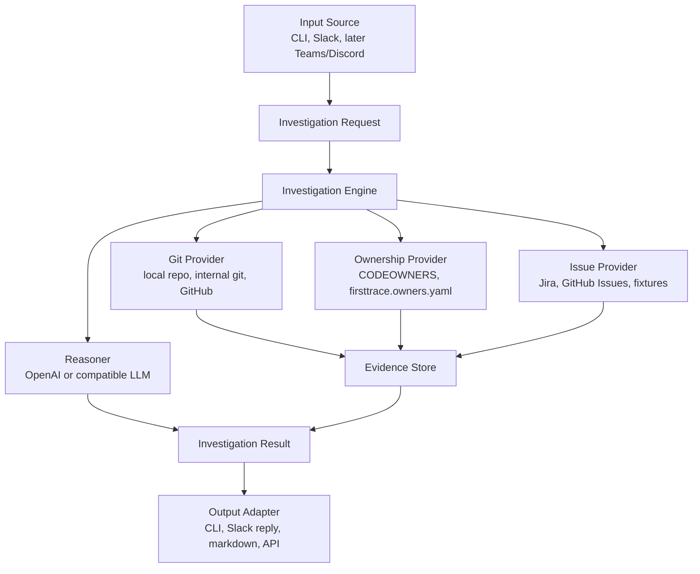

# FirstTrace Product Plan

FirstTrace is a self-hosted bug localization tool for teams with private,
internal, or public git repositories. It turns a messy bug report from chat,
CLI, or another source into a cited first investigation trail: likely component,
suspicious files, likely owner, related issues, and suggested next steps.

This document is the working blueprint. The README explains the project at a
high level; this plan describes what to build and in what order.

## Product Thesis

The first hour of debugging is usually evidence gathering, not coding. Engineers
read a vague bug report, search code, inspect recent commits, check ownership,
look through related tickets, and then ask the right person to investigate.

FirstTrace should automate that first pass without pretending to fix the bug.
The product wins when it gives a useful, cited starting point faster than a human
triager could assemble one manually.

## Design Principles

- **Evidence first:** every important claim should link back to a file, commit,
  owner rule, issue, or source message.
- **Read-only by default:** v0 should not write code, create tickets, or mutate
  customer systems.
- **Self-hostable:** teams should be able to run it near their private repos and
  internal systems.
- **Runtime-portable:** Slack, Jira, GitHub, Supabase, Redis, OCI, and Vercel are
  adapters, not core assumptions.
- **Eval before integrations:** the core investigation engine should prove it
  can find useful files and owners before Slack or other chat integrations.
- **Small trusted output:** a concise, grounded reply is better than a long,
  speculative report.

## Non-Goals

FirstTrace v0 is not:

- an autonomous coding agent
- a ticket-writing or ticket-routing system
- a generic workplace search product
- a replacement for on-call engineers
- a SaaS-only product
- a tool that needs write access to source code
- a workflow engine like Temporal

Fix suggestions, ticket creation, dashboards, scheduled indexing, and enterprise
admin features can come later.

## Architecture



The core investigation engine should not know whether the request came from
Slack or a CLI command. It should receive structured input, collect evidence,
rank the evidence, and return a structured result with citations.

## Core Data Model

```text
InvestigationRequest
  id
  source
  reportText
  threadContext
  repositories
  issueProjects
  createdAt

EvidenceItem
  id
  type: file | commit | diff | owner | issue | message
  title
  summary
  citation
  score
  metadata

InvestigationResult
  requestId
  classification: bug | feature_request | support_question | unknown
  likelyComponent
  confidence
  suspiciousFiles
  likelyOwners
  relatedIssues
  suggestedNextSteps
  citations
  warnings

WorkItemDraft
  title
  description
  owner
  areaPath
  tags
  severity
  priority
  sourceCitations

ChannelProfile
  goals
  ownershipRules
  responsePreferences
  enabledProviders

EvalCase
  id
  report
  repo
  expectedClassification
  expectedComponent
  expectedFiles
  expectedOwners
  expectedWorkItem
  notes
```

The first implementation can keep these as TypeScript types or plain JSON
schemas. The important boundary is that providers return evidence, and the
reasoner ranks evidence instead of inventing facts.

## Provider Interfaces

FirstTrace should be built around small provider interfaces:

```text
GitProvider
  listFiles()
  searchFiles(query)
  searchCommits(query)
  getFile(path)
  getDiff(commit)

OwnershipProvider
  getOwnersForPath(path)
  searchOwnership(query)

IssueProvider
  searchIssues(query)
  getIssue(id)

Reasoner
  rankEvidence(request, evidence)
  summarizeResult(request, rankedEvidence)

OutputAdapter
  render(result)
  send(result)
```

Phase 1 providers are deliberately simple:

- local git provider using the checked-out repository
- ownership YAML provider using `firsttrace.owners.yaml`
- CLI/markdown output adapter

Future phases add:

- OpenAI reasoner
- fixture issue provider for evals
- queue-backed worker output adapter

## Channel Agent Model

FirstTrace should support a generic channel-agent model without tying the core
product to any one chat platform or company workflow.

```text
ChannelProfile
  goals
  expected work types
  ownership and SME routing rules
  response preferences
  enabled apps and providers

SkillDefinition
  triage feedback
  log a bug or work item
  link related work items
  search existing work

Trigger
  manual CLI command
  at-mention
  emoji reaction
  top-level channel message
  API request
```

In this model, automatic triage can run on broad triggers, but write actions
such as creating a bug should require a deliberate trigger or an explicit policy
in the channel profile.

## Phased Roadmap

### Phase 1: Deterministic Local CLI - Complete

The implemented Phase 1 flow is:

```bash
npm run firsttrace -- investigate \
  --config firsttrace.config.yaml \
  --report "README deployment plan is unclear"
```

Current capability:

- read a YAML config with explicit repositories, docs, issue exports, owners,
  and search limits
- classify the report as bug, feature request, support question, or unknown
- search local files, configured docs, configured issue exports, and recent git
  commits
- resolve owners from path/glob rules
- rank deterministic evidence and print Markdown with citations

Limitations:

- no OpenAI reasoning
- no eval runner
- no worker
- no message delivery adapter
- no Slack, Docker, or npm publishing

### Phase 2: OpenAI Reasoner for Local CLI

Add an optional AI reasoning pass on top of Phase 1 evidence:

```bash
npm run firsttrace -- investigate \
  --config firsttrace.config.yaml \
  --report "checkout retry leaves the buyer stuck" \
  --ai
```

The CLI should continue to gather deterministic evidence first. OpenAI should
reason over that bounded evidence bundle, not crawl the repository blindly.

The AI-assisted result should include:

- likely files and components
- confidence
- owner and implementer hints from ownership rules and git history
- short explanation grounded in citations
- missing-information questions when evidence is weak

Local configuration:

- `OPENAI_API_KEY` from `.env.local` or the shell
- `OPENAI_MODEL_CHAT` from `.env.local` or the shell
- explicit opt-in through `--ai` or a config flag

### Phase 3: Eval Runner

Add eval cases before chat or worker integrations:

```bash
npm run firsttrace -- eval \
  --config firsttrace.config.yaml \
  --cases evals/example.yaml
```

The eval runner should compare deterministic and AI-assisted results and score:

- classification accuracy
- expected files found in top results
- expected owner found in top results
- expected component matched
- citation coverage
- unsupported claim count
- result usefulness

Private or customer-specific eval cases should stay outside the public
repository.

### Phase 4: Local Worker Runtime

Add a local asynchronous runtime that reuses the same investigation engine as the
CLI:

```text
submit report -> queued job -> worker -> investigation result
```

Job states:

- queued
- running
- succeeded
- failed

Start with a filesystem or in-memory queue. Do not add Redis, Supabase, OCI, or
Temporal until the local worker path is useful.

The worker should:

- accept jobs containing report text and config path
- run deterministic collection and optional OpenAI reasoning
- persist status, timestamps, result, and failure details
- make retries explicit and bounded

### Phase 5: Message Input Adapter

Add the simplest way to deliver messages to the worker before adding Slack:

```bash
npm run firsttrace -- submit \
  --config firsttrace.config.yaml \
  --report "checkout retry leaves the buyer stuck"
```

or a local HTTP endpoint:

```text
POST /investigations
```

The output should let a user submit a bug report, watch or fetch the result, and
confirm that the worker path works end to end.

### Later: Chat Adapter and Triggers

Slack can be the first chat adapter, but the core product should stay generic:

```text
Slack app mention -> Receiver -> Queue -> Worker -> Slack thread reply
```

The first chat adapter should:

- verify incoming requests
- acknowledge quickly
- fetch thread context
- enqueue an investigation request
- post or return the result
- support explicit triggers such as at-mentions and emoji reactions
- optionally support automatic triage on top-level messages

The investigation engine should remain chat-agnostic so Teams, Discord, Linear,
or other sources can be added later.

### Later: Work Item Provider

Add a write-capable provider only after triage output is trusted:

```text
WorkItemProvider
  createWorkItem()
  createChildWorkItem()
  linkWorkItems()
  searchWorkItems()
```

Initial write behavior should be explicit-trigger only. The provider interface
should support OCI work items, Jira, GitHub Issues, Linear, or another work item
system without changing the investigation engine.

### Later: Packaging and Deployment

Packaging comes after the tool is useful locally:

- npm publishing once the CLI is useful to external users
- Docker image once there is a real receiver/worker to run
- GitHub Container Registry first: `ghcr.io/temaus91/firsttrace`
- Docker Hub later if external adoption needs it

## Queue and Runtime Strategy

Queue implementations should be adapters:

```text
JobQueue
  InMemoryQueue      local tests
  RedisQueue         generic Docker Compose
  SupabaseQueue      Vercel/Supabase dogfood path
  VercelQueue        Vercel-native users
  OciQueue           OCI deployments
```

Recommended progression:

1. in-memory queue for local development
2. Redis queue for generic open-source Docker Compose
3. Supabase queue for Vercel/Supabase dogfood deployments
4. OCI queue for OCI deployments

The worker should be a normal long-running process. It can run locally, in a
container, in OCI Container Instances, on Kubernetes, or behind another queue
adapter.

## Eval Strategy

FirstTrace should be built eval-first because the main risk is not whether a
Slack bot can respond. The main risk is whether the investigation is useful.

Initial eval file:

```yaml
- id: checkout-retry-held-artwork
  report: "Buyer retried checkout after a Stripe redirect failed and the artwork stayed held."
  expected_component: "checkout/public exhibition"
  expected_files:
    - app/api/public-exhibitions/[slug]/checkout/route.ts
    - lib/server/checkout/resume-cookie.ts
    - lib/server/checkout/reconcile-session.ts
  expected_owner: "@checkout-platform"
```

Useful metrics:

- classification accuracy
- top-3 expected file recall
- top-5 expected file recall
- owner match
- component match
- citation coverage
- unsupported claim count
- write-action precision for bug/work-item creation evals
- result length

## Security and Privacy

FirstTrace is intended for private codebases, so security has to be part of the
design from the start:

- request read-only repo access by default
- support local/internal git repositories without GitHub dependency
- avoid logging source snippets unnecessarily
- make LLM inputs inspectable
- allow teams to choose where the worker runs
- store secrets in the host platform, not in config files
- make external API calls explicit and configurable

The first version can be simple, but it should avoid assumptions that would make
private-repo deployment hard later.

## Open-Source and Enterprise Model

The open-source core should include:

- CLI investigation flow
- local git provider
- ownership file support
- eval runner
- basic worker
- Slack adapter when ready
- Redis or simple queue adapter

Potential enterprise features:

- hosted control plane
- admin UI and run history
- SSO and audit logs
- fine-grained source redaction
- advanced Jira/Linear/ServiceNow integrations
- private model/provider controls
- scheduled repo indexing
- organization-wide ownership graph
- support contracts

Apache License 2.0 allows enterprise use while preserving room for a commercial
offering around hosting, integrations, support, and proprietary enterprise
features.

## Immediate Next Steps

1. Implement OpenAI reasoner for the local CLI.
2. Add the eval runner and eval case format.
3. Add local worker runtime.
4. Add local message delivery adapter.
5. Only then add Slack.

## Open Questions

- Should the CLI be the same binary/process as the worker?
- How much source text should be sent to the LLM by default?
- What is the minimum useful ownership file format?
- Should the first issue provider be Jira, GitHub Issues, or fixtures only?
- What result format should become the stable external contract?
