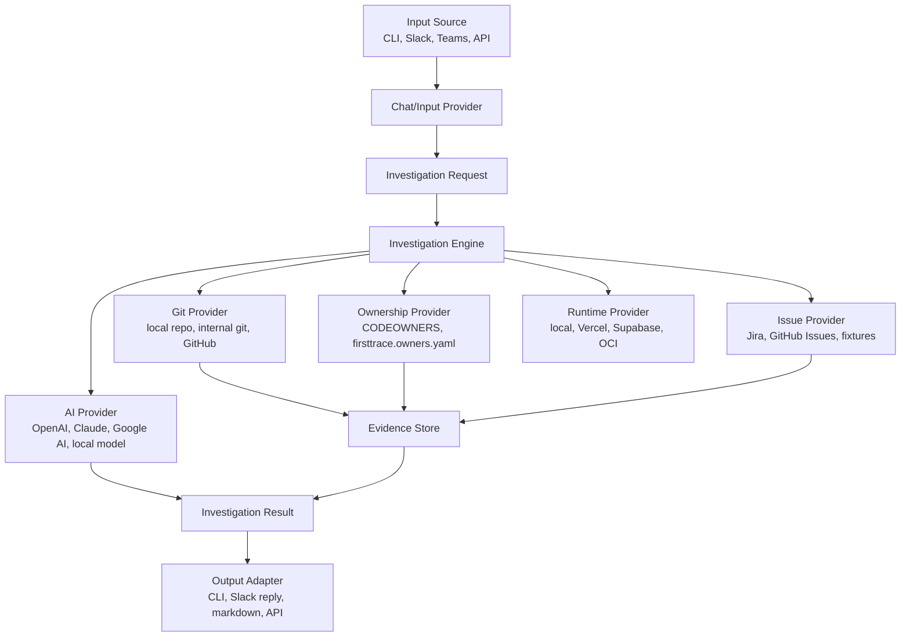

# FirstTrace Product Plan

FirstTrace is a self-hosted bug localization tool for teams with private,
internal, or public git repositories. It turns a messy bug report from chat,
CLI, or another source into a cited first investigation trail: likely component,
suspicious files, likely owner, related issues, and suggested next steps.

This document is the working blueprint. The README explains the project at a
high level; this plan describes what to build and in what order.

## Product Thesis

The first hour of debugging is usually evidence gathering, not coding. Engineers
read a vague bug report, search code, inspect recent commits, check ownership,
look through related tickets, and then ask the right person to investigate.

FirstTrace should automate that first pass without pretending to fix the bug.
The product wins when it gives a useful, cited starting point faster than a human
triager could assemble one manually.

## Design Principles

- **Evidence first:** every important claim should link back to a file, commit,
  owner rule, issue, or source message.
- **Read-only by default:** v0 should not write code, create tickets, or mutate
  customer systems.
- **Self-hostable:** teams should be able to run it near their private repos and
  internal systems.
- **Runtime-portable:** Slack, Jira, GitHub, Supabase, Redis, OCI, and Vercel are
  adapters, not core assumptions.
- **Eval before integrations:** the core investigation engine should prove it
  can find useful files and owners before Slack or other chat integrations.
- **Small trusted output:** a concise, grounded reply is better than a long,
  speculative report.

## Non-Goals

FirstTrace v0 is not:

- an autonomous coding agent
- a ticket-writing or ticket-routing system
- a generic workplace search product
- a replacement for on-call engineers
- a SaaS-only product
- a tool that needs write access to source code
- a workflow engine like Temporal

Fix suggestions, ticket creation, dashboards, scheduled indexing, and enterprise
admin features can come later.

## Architecture



The core investigation engine should not know whether the request came from
Slack or a CLI command. It should receive structured input, collect evidence,
rank the evidence, and return a structured result with citations.

## Core Data Model

```text
InvestigationRequest
  id
  source
  reportText
  threadContext
  repositories
  issueProjects
  createdAt

EvidenceItem
  id
  type: file | commit | diff | owner | issue | message
  title
  summary
  citation
  score
  metadata

InvestigationResult
  requestId
  classification: bug | feature_request | support_question | unknown
  likelyComponent
  confidence
  suspiciousFiles
  likelyOwners
  relatedIssues
  suggestedNextSteps
  citations
  warnings

WorkItemDraft
  title
  description
  owner
  areaPath
  tags
  severity
  priority
  sourceCitations

ChannelProfile
  goals
  ownershipRules
  responsePreferences
  enabledProviders

EvalCase
  id
  report
  repo
  expectedClassification
  expectedComponent
  expectedFiles
  expectedOwners
  expectedWorkItem
  notes
```

The first implementation can keep these as TypeScript types or plain JSON
schemas. The important boundary is that providers return evidence, and the AI
provider reasons over that evidence instead of inventing facts.

## Provider Interfaces

FirstTrace should be built around small provider interfaces:

```text
GitProvider
  listFiles()
  searchFiles(query)
  searchCommits(query)
  getFile(path)
  getDiff(commit)

OwnershipProvider
  getOwnersForPath(path)
  searchOwnership(query)

IssueProvider
  searchIssues(query)
  getIssue(id)

AiProvider
  reason(request, evidence)

InputProvider
  receive()
  normalize()

OutputAdapter
  render(result)
  send(result)

RuntimeProvider
  enqueue(job)
  runWorker()
  persistResult(result)
```

Phase 1 providers are deliberately simple:

- local git provider using the checked-out repository
- ownership YAML provider using `firsttrace.config.yaml`
- CLI/markdown output adapter

Future phases add:

- OpenAI AI provider first, with Claude, Google AI, or local model providers
  possible later
- fixture issue provider for evals
- Slack chat provider first, with Teams or other chat providers possible later
- GitHub issue/code provider, Vercel/Supabase runtime providers, and OCI
  deployment/runtime providers as adapters

Provider implementations can depend on a vendor SDK, but the core investigation
engine should only depend on the provider interfaces. Adding Slack, OpenAI,
GitHub, Vercel, Supabase, OCI, Claude, Google AI, Teams, or another service
should not require rewriting the core search, evidence, reasoning, evaluation,
or rendering flow.

## Channel Agent Model

FirstTrace should support a generic channel-agent model without tying the core
product to any one chat platform or company workflow.

```text
ChannelProfile
  goals
  expected work types
  ownership and SME routing rules
  response preferences
  enabled apps and providers

SkillDefinition
  triage feedback
  log a bug or work item
  link related work items
  search existing work

Trigger
  manual CLI command
  at-mention
  emoji reaction
  top-level channel message
  API request
```

In this model, automatic triage can run on broad triggers, but write actions
such as creating a bug should require a deliberate trigger or an explicit policy
in the channel profile.

## Phased Roadmap

### Phase 1: Deterministic Local CLI - Complete

The implemented Phase 1 flow is:

```bash
npm run firsttrace -- investigate \
  --config firsttrace.config.yaml \
  --report "README deployment plan is unclear"
```

Current capability:

- read a YAML config with explicit repositories, docs, issue exports, owners,
  and search limits
- classify the report as bug, feature request, support question, or unknown
- search local files, configured docs, configured issue exports, and recent git
  commits
- resolve owners from path/glob rules
- rank deterministic evidence and print Markdown with citations

Limitations:

- no OpenAI reasoning
- no eval runner
- no worker
- no message delivery adapter
- no Slack, Docker, or npm publishing

### Phase 2: OpenAI Reasoner for Local CLI - Complete

The implemented Phase 2 flow adds an optional AI reasoning pass on top of Phase
1 evidence:

```bash
npm run firsttrace -- investigate \
  --config firsttrace.config.yaml \
  --report "checkout retry leaves the buyer stuck" \
  --ai
```

The CLI continues to gather deterministic evidence first. OpenAI reasons over
that bounded evidence bundle, not the repository directly.

Current capability:

- opt-in `--ai` flag for local CLI investigations
- provider interface for AI reasoning so later Claude, Google AI, or local model
  providers can be added without changing the core engine
- OpenAI provider using structured output
- `.env.local` support for local credentials
- AI result section with likely files/components, confidence, owner and
  implementer hints, explanation, missing-information questions, warnings, and
  citations

Local configuration:

- `OPENAI_API_KEY` from `.env.local` or the shell
- `OPENAI_MODEL_CHAT` from `.env.local` or the shell
- `FIRSTTRACE_AI_PROVIDER=openai` by default
- explicit opt-in through `--ai`

Limitations:

- no eval runner
- no worker
- no message delivery adapter
- no Slack, Teams, Docker, npm publishing, or work-item creation

### Phase 3: Eval Runner - Complete

The implemented Phase 3 flow adds eval cases before chat or worker integrations:

```bash
npm run firsttrace -- eval \
  --config firsttrace.config.yaml \
  --cases evals/example.yaml
```

Optional AI comparison:

```bash
npm run firsttrace -- eval \
  --config firsttrace.config.yaml \
  --cases evals/example.yaml \
  --ai
```

Current capability:

- load YAML eval case arrays
- run deterministic investigations for every case
- optionally run the configured AI provider on the same deterministic evidence
- score classification accuracy, expected files, expected owners, expected
  component, citation coverage, unsupported AI citation warnings, and aggregate
  usefulness
- print a Markdown eval summary and per-case pass/fail detail
- exit nonzero when a required expectation fails or the cases file is invalid

Private or customer-specific eval cases should stay outside the public
repository.

Limitations:

- no worker
- no message delivery adapter
- no Slack, Teams, Docker, npm publishing, or work-item creation

### Phase 4: Local Worker Runtime - Complete

The implemented Phase 4 flow adds a local asynchronous runtime that reuses the
same investigation engine as the CLI:

```bash
npm run firsttrace -- worker enqueue \
  --config firsttrace.config.yaml \
  --report "README deployment plan is unclear"

npm run firsttrace -- worker run --once

npm run firsttrace -- worker status --job <job-id>
```

Current capability:

- filesystem-backed queue under `.firsttrace/jobs`
- generic `JobQueue` interface with a filesystem provider
- one JSON file per investigation job
- queued, running, succeeded, and failed job states
- persisted timestamps, attempts, config path, report, AI flag, result, and
  error details
- deterministic worker processing using the shared investigation path
- optional AI worker processing using the same AI provider path as
  `investigate --ai`

Limitations:

- no Slack, Teams, Docker, npm publishing, Redis, Supabase, OCI, or work-item
  creation

### Phase 5: Message Input Adapter - Complete

The implemented Phase 5 flow adds a local message delivery adapter before Slack:

```bash
npm run firsttrace -- submit \
  --config firsttrace.config.yaml \
  --report "checkout retry leaves the buyer stuck"
```

Current capability:

- `submit` validates local message input
- creates a queued investigation job through the generic queue interface
- records source metadata such as `local-cli`
- prints the worker command and status command needed to process or fetch the
  result
- supports optional AI reasoning with `--ai`
- keeps the path compatible with future chat adapters

Limitations:

- no local HTTP endpoint
- no Slack, Teams, hosted receiver, or webhook handling

### Phase 6: Hosted Vercel/Supabase Runtime

Add a hosted backend path for teams that want FirstTrace to run as a dedicated
service:

```text
Vercel Receiver -> Supabase Queue/Database -> Worker Process -> Result Store
```

The hosted runtime should:

- expose provider-neutral HTTP endpoints for submitted investigations
- store jobs, status, attempts, and results in Supabase
- keep secrets in Vercel/Supabase environment variables, not repo config
- reuse the same worker and investigation engine as the local CLI
- preserve the generic `JobQueue` and runtime provider boundaries
- support local development with the same request and result contracts

Vercel and Supabase should be adapters, not assumptions in the core
investigation logic. A future Docker, OCI, Kubernetes, Redis, or Postgres
deployment should be able to reuse the same core worker.

### Phase 7: GitHub Provider for Private/Public Repositories

Add a GitHub repository provider so hosted FirstTrace can inspect configured
GitHub repositories without relying on a local checkout:

```text
GitHub App -> GitHub Provider -> Evidence Collector
```

The provider should:

- use a GitHub App with read-only repository permissions by default
- support public and private repositories selected during app installation
- read repo contents, paths, branches, commits, and ownership metadata
- keep app id, installation id, and private key in environment secrets
- keep repository owner/name, branch, docs, and ownership mapping in config
- avoid hardcoded company, repository, or channel names

Local git should remain a first-class provider. GitHub is the first hosted git
provider, not the only git provider.

### Phase 8: Slack Chat Provider and Channel Config

Slack can be the first chat adapter, but the core product should stay generic:

```text
Slack message -> Receiver -> Queue -> Worker -> Slack thread reply
```

The first chat adapter should:

- verify incoming requests
- acknowledge quickly
- fetch thread context
- enqueue an investigation request
- post a concise cited result back to Slack
- restrict automatic handling to configured channel ids
- support configured triggers such as top-level messages, app mentions, and
  emoji reactions
- keep channel names, channel ids, trigger behavior, and repo routing in config

The investigation engine should remain chat-agnostic so Teams, Discord, Linear,
or other sources can be added later.

### Phase 9: Hosted Setup Guide and End-to-End Dogfood

Prove the full hosted workflow for a generic company setup:

```text
configured Slack channel
  -> Vercel receiver
  -> Supabase-backed job
  -> worker
  -> GitHub private repo evidence
  -> AI reasoning
  -> Slack thread reply
```

This phase should verify:

- a configured Slack channel can submit a bug report without CLI access
- an unconfigured channel is ignored or receives a safe denial
- the backend validates Slack signatures before enqueueing work
- the worker can read a private GitHub repository through the configured provider
- AI reasoning uses gathered evidence and citations
- the Slack reply names likely files, likely owner or implementer context,
  confidence, citations, and missing-info questions
- no company-specific names, repositories, or channels are hardcoded

### Later: Work Item Provider

Add a write-capable provider only after triage output is trusted:

```text
WorkItemProvider
  createWorkItem()
  createChildWorkItem()
  linkWorkItems()
  searchWorkItems()
```

Initial write behavior should be explicit-trigger only. The provider interface
should support OCI work items, Jira, GitHub Issues, Linear, or another work item
system without changing the investigation engine.

### Later: Packaging and Deployment

Packaging comes after the tool is useful locally:

- npm publishing once the CLI is useful to external users
- Docker image once there is a real receiver/worker to run
- GitHub Container Registry first: `ghcr.io/temaus91/firsttrace`
- Docker Hub later if external adoption needs it

## Queue and Runtime Strategy

Queue implementations should be adapters:

```text
JobQueue
  InMemoryQueue      local tests
  FileSystemQueue    local worker runtime
  SupabaseQueue      Vercel/Supabase hosted path
  RedisQueue         generic Docker Compose
  VercelQueue        Vercel-native users
  OciQueue           OCI deployments
```

Recommended progression:

1. filesystem or in-memory queue for local development
2. Supabase queue for Vercel/Supabase hosted deployments
3. Redis queue for generic open-source Docker Compose
4. OCI queue for OCI deployments

The worker should be a normal long-running process. It can run locally, in a
container, in OCI Container Instances, on Kubernetes, or behind another queue
adapter.

## Eval Strategy

FirstTrace should be built eval-first because the main risk is not whether a
Slack bot can respond. The main risk is whether the investigation is useful.

Initial eval file:

```yaml
- id: checkout-retry-held-artwork
  report: "Buyer retried checkout after a Stripe redirect failed and the artwork stayed held."
  expected_component: "checkout/public exhibition"
  expected_files:
    - app/api/public-exhibitions/[slug]/checkout/route.ts
    - lib/server/checkout/resume-cookie.ts
    - lib/server/checkout/reconcile-session.ts
  expected_owner: "@checkout-platform"
```

Useful metrics:

- classification accuracy
- top-3 expected file recall
- top-5 expected file recall
- owner match
- component match
- citation coverage
- unsupported claim count
- write-action precision for bug/work-item creation evals
- result length

## Security and Privacy

FirstTrace is intended for private codebases, so security has to be part of the
design from the start:

- request read-only repo access by default
- support local/internal git repositories without GitHub dependency
- avoid logging source snippets unnecessarily
- make LLM inputs inspectable
- allow teams to choose where the worker runs
- store secrets in the host platform, not in config files
- make external API calls explicit and configurable

The first version can be simple, but it should avoid assumptions that would make
private-repo deployment hard later.

## Open-Source and Enterprise Model

The open-source core should include:

- CLI investigation flow
- local git provider
- ownership file support
- eval runner
- basic worker
- Slack adapter when ready
- Redis or simple queue adapter

Potential enterprise features:

- hosted control plane
- admin UI and run history
- SSO and audit logs
- fine-grained source redaction
- advanced Jira/Linear/ServiceNow integrations
- private model/provider controls
- scheduled repo indexing
- organization-wide ownership graph
- support contracts

Apache License 2.0 allows enterprise use while preserving room for a commercial
offering around hosting, integrations, support, and proprietary enterprise
features.

## Immediate Next Steps

1. Add hosted Vercel/Supabase runtime support.
2. Add GitHub App provider for private and public repositories.
3. Add Slack chat provider and channel configuration.
4. Verify the hosted end-to-end workflow from configured Slack channel to AI
   analysis reply.
5. Add GitHub, Vercel/Supabase, OCI, and work-item providers only through the
   generic provider interfaces.

## Open Questions

- Should the CLI be the same binary/process as the worker?
- What is the minimum useful ownership file format?
- Should the first issue provider be Jira, GitHub Issues, or fixtures only?
- What result format should become the stable external contract?
