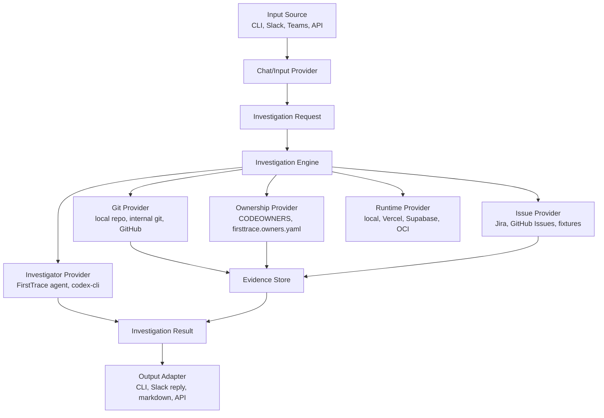

# FirstTrace Product Plan

FirstTrace is a self-hosted bug localization tool for teams with private,
internal, or public git repositories. It turns a messy bug report from chat,
CLI, or another source into a cited first investigation trail: likely component,
suspicious files, likely owner, related issues, and suggested next steps.

This document is the working blueprint. The README explains the project at a
high level; this plan describes what to build and in what order.

## Product Thesis

The first hour of debugging is usually evidence gathering, not coding. Engineers
read a vague bug report, search code, inspect recent commits, check ownership,
look through related tickets, and then ask the right person to investigate.

FirstTrace should automate that first pass without pretending to fix the bug.
The product wins when it gives a useful, cited starting point faster than a human
triager could assemble one manually.

## Design Principles

- **Evidence first:** every important claim should link back to a file, commit,
  owner rule, issue, or source message.
- **Read-only by default:** v0 should not write code, create tickets, or mutate
  customer systems.
- **Self-hostable:** teams should be able to run it near their private repos and
  internal systems.
- **Runtime-portable:** Slack, Jira, GitHub, Supabase, Redis, OCI, and Vercel are
  adapters, not core assumptions.
- **Eval before integrations:** the core investigation engine should prove it
  can find useful files and owners before Slack or other chat integrations.
- **Small trusted output:** a concise, grounded reply is better than a long,
  speculative report.

## Non-Goals

FirstTrace v0 is not:

- an autonomous code-writing or code-fixing agent
- a ticket-writing or ticket-routing system
- a generic workplace search product
- a replacement for on-call engineers
- a SaaS-only product
- a tool that needs write access to source code
- a workflow engine like Temporal

Fix suggestions, ticket creation, dashboards, scheduled indexing, and enterprise
admin features can come later.

## Architecture



The core investigation engine should not know whether the request came from
Slack or a CLI command. It should receive structured input, collect evidence,
rank the evidence, and return a structured result with citations.

## Core Data Model

```text
InvestigationRequest
  id
  source
  reportText
  threadContext
  repositories
  issueProjects
  createdAt

EvidenceItem
  id
  type: file | commit | diff | owner | issue | message
  title
  summary
  citation
  score
  metadata

InvestigationResult
  requestId
  classification: bug | feature_request | support_question | unknown
  likelyComponent
  confidence
  suspiciousFiles
  likelyOwners
  relatedIssues
  suggestedNextSteps
  citations
  warnings

WorkItemDraft
  title
  description
  owner
  areaPath
  tags
  severity
  priority
  sourceCitations

ChannelProfile
  goals
  ownershipRules
  responsePreferences
  enabledProviders

EvalCase
  id
  report
  repo
  expectedClassification
  expectedComponent
  expectedFiles
  expectedOwners
  expectedWorkItem
  notes
```

The first implementation can keep these as TypeScript types or plain JSON
schemas. The important boundary is that providers return evidence, and the
investigator reasons over that evidence with read-only tools instead of
inventing facts.

## Provider Interfaces

FirstTrace should be built around small provider interfaces:

```text
GitProvider
  listFiles()
  searchFiles(query)
  searchCommits(query)
  getFile(path)
  getDiff(commit)

OwnershipProvider
  getOwnersForPath(path)
  searchOwnership(query)

IssueProvider
  searchIssues(query)
  getIssue(id)

InvestigatorProvider
  investigate(request, evidence, tools)
  returnStructuredResult()

InvestigationToolset
  readFile(path)
  searchRepo(query)
  findReferences(symbolOrPath)
  gitLog(path)
  gitBlame(path, line)
  runSafeCommand(command)

AiProvider
  structuredCompletion(prompt, schema)

InputProvider
  receive()
  normalize()

OutputAdapter
  render(result)
  send(result)

RuntimeProvider
  enqueue(job)
  runWorker()
  persistResult(result)
```

Phase 1 providers are deliberately simple:

- local git provider using the checked-out repository
- ownership YAML provider using `firsttrace.config.yaml`
- CLI/markdown output adapter

Future phases add:

- read-only FirstTrace agent provider first, powered by OpenAI and
  `OPENAI_MODEL_CHAT`
- later `codex-cli` investigator adapter using the same model and the same
  structured result contract
- fixture issue provider for evals
- Slack chat provider first, with Teams or other chat providers possible later
- GitHub issue/code provider, Vercel/Supabase runtime providers, and OCI
  deployment/runtime providers as adapters

Provider implementations can depend on a vendor SDK, but the core investigation
engine should only depend on the provider interfaces. Adding Slack, OpenAI,
GitHub, Vercel, Supabase, OCI, `codex-cli`, Teams, or another service should not
require rewriting the core search, evidence, investigation, evaluation, or
rendering flow.

## Channel Agent Model

FirstTrace should support a generic channel-agent model without tying the core
product to any one chat platform or company workflow.

```text
ChannelProfile
  goals
  expected work types
  ownership and SME routing rules
  response preferences
  enabled apps and providers

SkillDefinition
  triage feedback
  log a bug or work item
  link related work items
  search existing work

Trigger
  manual CLI command
  at-mention
  emoji reaction
  top-level channel message
  API request
```

In this model, automatic triage can run on broad triggers, but write actions
such as creating a bug should require a deliberate trigger or an explicit policy
in the channel profile.

## Phased Roadmap

### Phase 1: Deterministic Local CLI - Complete

The implemented Phase 1 flow is:

```bash
firsttrace investigate \
  --config firsttrace.config.yaml \
  --report "README deployment plan is unclear"
```

Current capability:

- read a YAML config with explicit repositories, docs, issue exports, owners,
  and search limits
- classify the report as bug, feature request, support question, or unknown
- search local files, configured docs, configured issue exports, and recent git
  commits
- resolve owners from path/glob rules
- rank deterministic evidence and print Markdown with citations

Limitations:

- no OpenAI reasoning
- no eval runner
- no worker
- no message delivery adapter
- no Slack, Docker, or npm publishing

### Phase 2: OpenAI Reasoner for Local CLI - Complete

The implemented Phase 2 flow adds an optional AI reasoning pass on top of Phase
1 evidence:

```bash
firsttrace investigate \
  --config firsttrace.config.yaml \
  --report "checkout retry leaves the buyer stuck" \
  --ai
```

The CLI continues to gather deterministic evidence first. OpenAI reasons over
that bounded evidence bundle, not the repository directly.

Current capability:

- opt-in `--ai` flag for local CLI investigations
- provider interface for the current one-shot AI reasoning path
- OpenAI provider using structured output
- `.env.local` support for local credentials
- AI result section with likely files/components, confidence, owner and
  implementer hints, explanation, missing-information questions, warnings, and
  citations

Local configuration:

- `OPENAI_API_KEY` from `.env.local` or the shell
- `OPENAI_MODEL_CHAT` from `.env.local` or the shell for the existing completed
  reasoner path
- `FIRSTTRACE_AI_PROVIDER=openai` by default
- `FIRSTTRACE_INVESTIGATOR=agent|evidence|codex-cli`, with `agent` as the
  default when `--ai` is enabled
- explicit opt-in through `--ai`

Planned model direction:

- move the default `OPENAI_MODEL_CHAT` value from `gpt-4o-mini` to
  `gpt-5.4-mini`
- use `OPENAI_MODEL_CHAT` as the shared model selector for `agent`, `evidence`,
  and later `codex-cli`
- avoid cross-model benchmarking for now; compare investigation modes, not model
  families

Limitations:

- no eval runner
- no worker
- no message delivery adapter
- no Slack, Teams, Docker, npm publishing, or work-item creation

### Phase 3: Eval Runner - Complete

The implemented Phase 3 flow adds eval cases before chat or worker integrations:

```bash
firsttrace eval \
  --config firsttrace.config.yaml \
  --cases evals/example.yaml
```

Optional AI comparison:

```bash
firsttrace eval \
  --config firsttrace.config.yaml \
  --cases evals/example.yaml \
  --ai
```

Current capability:

- load YAML eval case arrays
- run deterministic investigations for every case
- optionally run the configured AI provider on the same deterministic evidence
- score classification accuracy, expected files, expected owners, expected
  component, citation coverage, unsupported AI citation warnings, and aggregate
  usefulness
- print a Markdown eval summary and per-case pass/fail detail
- exit nonzero when a required expectation fails or the cases file is invalid

Private or customer-specific eval cases should stay outside the public
repository.

Limitations:

- no worker
- no message delivery adapter
- no Slack, Teams, Docker, npm publishing, or work-item creation

### Phase 4: Local Worker Runtime - Complete

The implemented Phase 4 flow adds a local asynchronous runtime that reuses the
same investigation engine as the CLI:

```bash
firsttrace worker enqueue \
  --config firsttrace.config.yaml \
  --report "README deployment plan is unclear"

firsttrace worker run --once

firsttrace worker status --job <job-id>
```

Current capability:

- filesystem-backed queue under `.firsttrace/jobs`
- generic `JobQueue` interface with a filesystem provider
- one JSON file per investigation job
- queued, running, succeeded, and failed job states
- persisted timestamps, attempts, config path, report, AI flag, result, and
  error details
- deterministic worker processing using the shared investigation path
- optional AI worker processing using the same AI provider path as
  `investigate --ai`

Limitations:

- no Slack, Teams, Docker, npm publishing, Redis, Supabase, OCI, or work-item
  creation

### Phase 5: Message Input Adapter - Complete

The implemented Phase 5 flow adds a local message delivery adapter before Slack:

```bash
firsttrace submit \
  --config firsttrace.config.yaml \
  --report "checkout retry leaves the buyer stuck"
```

Current capability:

- `submit` validates local message input
- creates a queued investigation job through the generic queue interface
- records source metadata such as `local-cli`
- prints the worker command and status command needed to process or fetch the
  result
- supports optional AI reasoning with `--ai`
- keeps the path compatible with future chat adapters

Limitations:

- no local HTTP endpoint
- no Slack, Teams, hosted receiver, or webhook handling

### Phase 6: Hosted Vercel/Supabase Runtime - Complete

The implemented Phase 6 flow adds a hosted backend path for teams that want
FirstTrace to run as a dedicated service:

```text
Vercel Receiver -> Supabase Queue/Database -> Worker Process -> Result Store
```

Current capability:

- async `JobQueue` boundary shared by filesystem and Supabase queues
- Supabase-backed job storage in `firsttrace_jobs`
- atomic Supabase job claiming through `firsttrace_claim_next_job()`
- queue selection with `--queue filesystem|supabase` or
  `FIRSTTRACE_QUEUE_PROVIDER`
- provider-neutral Vercel-compatible endpoints:
  - `POST /api/investigations`
  - `GET /api/jobs?id=<job-id>`
  - `GET|POST /api/worker/run-once`
- required bearer auth through `FIRSTTRACE_RECEIVER_TOKEN`, unless
  `FIRSTTRACE_ALLOW_UNAUTHENTICATED_RECEIVER=true` is explicitly set for local
  development
- worker reuse of the same investigation engine as the local CLI
- Vercel background worker execution from Slack events plus a protected
  `run-once` endpoint for manual runs or cron-capable deployments

Vercel and Supabase should be adapters, not assumptions in the core
investigation logic. A future Docker, OCI, Kubernetes, Redis, or Postgres
deployment should be able to reuse the same core worker.

Limitations:

- no Teams or non-Slack webhook provider
- worker execution is one-job-at-a-time and should be hardened before larger
  customer traffic
- local readiness can pass while optional live checks remain blocked

### Phase 7: GitHub Provider for Private/Public Repositories - Complete

The implemented Phase 7 flow adds a GitHub App-backed repository provider so
hosted FirstTrace can inspect configured GitHub repositories without relying on
a pre-existing local checkout:

```text
GitHub App -> GitHub Provider -> Evidence Collector
```

Current capability:

- local `path` repository configs remain valid and default to `provider: local`
- `provider: github` repository configs support owner, repo, and default branch
- GitHub App credentials are read from environment secrets
- local validation can use `GITHUB_TOKEN` when a user-scoped token already has read
  access to the target repository
- escaped private-key newlines are normalized for hosted env stores
- short-lived installation tokens are created at runtime
- clone/fetch uses `git -c http.extraHeader="Authorization: Basic <redacted>"`
  so tokens are not stored in remote URLs or git config
- GitHub repos are cached under ignored `.firsttrace/github/`
- after materialization, the existing file search, doc search, commit search,
  owner matching, AI reasoning, eval, worker, and queue flows run unchanged

Required environment variables:

```text
GITHUB_APP_ID
GITHUB_APP_INSTALLATION_ID
GITHUB_APP_PRIVATE_KEY
```

Local-only fallback:

```text
GITHUB_TOKEN
```

Limitations:

- no Slack, Teams, or webhook provider
- no GitHub Issues or pull request evidence provider
- no ticket creation or repository write access
- live private-repo testing requires a user-created GitHub App and local ignored
  config

Local git should remain a first-class provider. GitHub is the first hosted git
provider, not the only git provider.

### Phase 8: Slack Chat Provider and Channel Config - Complete

The implemented Phase 8 flow adds Slack as the first chat adapter while keeping
the core product generic:

```text
Slack message -> Receiver -> Queue -> Worker -> Slack thread reply
```

Current capability:

- verify incoming requests
- handle Slack URL verification challenges
- acknowledge events quickly after enqueueing or ignoring them
- dedupe Slack retries by team, trigger, channel, source message timestamp, and
  reaction name when applicable
- restrict automatic handling to configured Slack channel ids
- support configured triggers for top-level messages, app mentions, and emoji
  reactions
- fetch reacted message text before enqueueing reaction-triggered jobs
- fetch thread message text for app mentions in threads when a Slack client is
  configured
- enqueue normalized investigation jobs through the generic `JobQueue`
- post concise cited worker results back to Slack threads when `SLACK_BOT_TOKEN`
  is configured
- keep channel names, channel ids, trigger behavior, AI opt-in, and repo routing
  in config

Required environment variables for hosted Slack:

```text
SLACK_SIGNING_SECRET
SLACK_BOT_TOKEN
```

Limitations:

- no live Slack workspace smoke test has run yet
- no Slack command shortcut or modal flow
- no Slack retry/deduplication table beyond the existing queue/job records
- channel repository routing is parsed and preserved, but repository subset
  filtering is deferred until multi-repo hosted deployment needs it

The investigation engine should remain chat-agnostic so Teams, Discord, Linear,
or other sources can be added later.

### Phase 9A: Hosted Deployment Readiness Runner - Complete

The implemented Phase 9A flow proves the hosted orchestration path locally
without pretending live external services have passed:

```bash
firsttrace hosted verify \
  --config examples/hosted.local.config.yaml \
  --queue filesystem \
  --report "README deployment plan is unclear"
```

Current capability:

- creates a synthetic signed Slack event and sends it through the Slack Events
  receiver
- enqueues through the selected queue provider
- runs the existing worker once against that queue
- uses a fake Slack notifier by default so local verification does not post to
  Slack
- supports `--queue filesystem|supabase`, `--ai`, `--channel <id>`, and
  `--live-slack-post`
- renders a Markdown pass/fail report with job status, result component, owners,
  captured Slack reply summary, and external readiness checks
- keeps live Slack, GitHub App, and Supabase checks tracked as blocked or
  skipped until credentials and infrastructure are available

Limitations:

- no live Slack workspace smoke test has run yet
- no live GitHub App clone/fetch smoke test has run yet
- live Supabase queue processing is still blocked until `firsttrace_jobs` is
  applied in a dedicated Supabase project
- local readiness can pass while optional live checks remain blocked

### Phase 9B: Live Hosted Verification

Prove the full hosted workflow for a generic company setup:

```text
configured Slack channel
  -> Vercel receiver
  -> Supabase-backed job
  -> worker
  -> GitHub private repo evidence
  -> configured investigator
  -> Slack thread reply
```

This phase should verify:

- a configured Slack channel can submit a bug report without CLI access
- an unconfigured channel is ignored or receives a safe denial
- the backend validates Slack signatures before enqueueing work
- the worker can read a private GitHub repository through the configured provider
- the configured investigator uses gathered evidence and citations
- the Slack reply names likely files, likely owner or implementer context,
  confidence, citations, and missing-info questions
- no company-specific names, repositories, or channels are hardcoded

### Phase 9C: OCI Queue Runtime - Implemented

Add an Oracle Cloud Infrastructure deployment path without removing or
weakening the existing Vercel/Supabase path. The goal is side-by-side production validation:
one Slack app or channel can keep using Vercel/Supabase while another can use
OCI, or a later router can select the runtime per channel/prefix.

Preferred OCI shape for the first implementation:

```text
Slack Event
  -> OCI HTTPS receiver
  -> OCI Queue message
  -> OCI worker container
  -> OCI Object Storage dedupe/processing marker
  -> GitHub repo materialization
  -> configured investigator
  -> Slack thread processing message + final reply
```

Deliberate scope:

- keep Vercel/Supabase adapters and production deployment intact
- add OCI as a new runtime adapter, not a replacement
- use OCI Queue as the work queue from the start
- avoid Autonomous Database in the first OCI deployment unless the need for a
  queryable dashboard or long-term job history becomes real
- treat Slack as the long-term human-readable history
- use OCI Object Storage only for small runtime markers:
  - Slack event dedupe key
  - processing message timestamp
  - final status marker for retry safety
- keep queue messages small enough for OCI Queue limits by storing only report,
  Slack source, config/runtime hints, and correlation ids

Why Queue plus Object Storage marker instead of a database:

- OCI Queue is the correct primitive for work delivery, visibility timeout,
  retries, and dead-letter handling
- FirstTrace does not need queryable job history for OCI deployment if Slack keeps
  the visible history
- Object Storage markers are enough to avoid duplicate replies when Slack
  retries events or OCI Queue redelivers work
- this keeps the OCI MVP smaller than adding Autonomous Database, schema
  migrations, SQL claim logic, and DB credentials

Implemented FirstTrace code changes:

- package-based OCI image that installs the `firsttrace` npm package tarball and
  includes Node, git, and ripgrep so hosted investigations have the same search
  tools locally and in production
- generic long-running HTTP server for non-Vercel runtimes:
  - `POST /api/slack/events`
  - `POST /api/investigations`
  - `GET /api/jobs?id=<id>` can be omitted or return queue-marker status only
  - `GET|POST /api/worker/run-once` for manual repair/debug
- `OciQueue` adapter for OCI Queue publish/consume/delete/update
- Object Storage runtime state backed by Object Storage for dedupe and processing
  markers
- Slack notifier support for:
  - posting a short "processing" reply immediately after enqueue/claim
  - storing that processing message timestamp in the marker
  - posting the final investigation reply in the same thread
  - skipping duplicate final replies when a marker already says completed
- config/runtime selection:
  - `FIRSTTRACE_QUEUE_PROVIDER=oci`
  - OCI compartment/queue/object-storage env vars
  - no company-specific Slack channel names or repo names in core code
- Terraform-first deployment under `deploy/oci` for OCI Resource Manager or
  local Terraform
- Vault sync helper that imports runtime secrets without storing secret values in
  Terraform state

OCI resources:

- OCI Queue for job delivery
- OCI Container Registry for the FirstTrace image
- OCI Container Instances or a small Compute VM for receiver/worker containers
- OCI Object Storage bucket for dedupe/processing/final markers
- OCI Vault for Slack, GitHub, OpenAI, and receiver secrets
- OCI API Gateway for a public HTTPS Slack Events URL

OCI account plan:

- create a new OCI account and choose the home region carefully
- create or choose a `firsttrace` compartment
- set budget alerts before deploying anything
- use the Oracle Cloud Free Trial credits for Queue, Container Registry,
  Container Instances/API Gateway/Load Balancer experiments
- keep Always Free-compatible resources where possible, but do not assume OCI
  Queue is Always Free; verify pricing before leaving it running

Production validation plan:

1. Deploy OCI receiver and worker container with `FIRSTTRACE_QUEUE_PROVIDER=oci`.
2. Point the configured Slack app Event Subscription request URL to the OCI URL.
3. Post the same bug report to Vercel/Supabase and OCI.
4. Confirm OCI posts one processing reply and one final reply.
5. Re-send the same Slack event payload and confirm dedupe suppresses duplicate
   final replies.
6. Stop the worker mid-job and confirm OCI Queue redelivers after visibility
   timeout or moves to DLQ after configured attempts.
7. Compare investigation quality and latency against Vercel/Supabase.

### Phase 10: Read-Only Agentic Investigator

Improve investigation quality by turning the current one-shot evidence summary
into a small read-only debugging agent:

```text
Slack report
  -> retrieve candidate files and commits
  -> FirstTrace agent
  -> read files, follow imports/usages, inspect git history/blame
  -> optionally run safe allowlisted commands
  -> return cited structured JSON
  -> Slack handoff
```

The current deterministic search should remain useful as the first candidate
generator and as the fallback path. The new agent should iterate over those
candidates with explicit read-only tools instead of asking the model to summarize
one fixed evidence bundle.

Target behavior:

- use `OPENAI_MODEL_CHAT=gpt-5.4-mini` for production validation
- do not add a separate model env var for agent mode
- add an investigator mode such as `FIRSTTRACE_INVESTIGATOR=agent`
- keep the existing evidence mode available as a fallback, for example
  `FIRSTTRACE_INVESTIGATOR=evidence`
- expose only bounded tools: `readFile`, `searchRepo`, `findReferences`,
  `gitLog`, `gitBlame`, and allowlisted `runSafeCommand`
- enforce max steps, max runtime, max file bytes, and command allowlists
- require structured JSON with cited files, lines, commits, authors, confidence,
  missing information, and warnings
- make the agent usable from CLI, local worker, and Supabase-backed worker
  without requiring Docker
- test quality with eval cases and live Slack reports

Non-goals for this phase:

- no code edits or write actions
- no arbitrary shell access
- no dependency on `codex-cli`
- no benchmark against `gpt-5.3-codex`

### Later: Codex CLI Investigator Adapter

After the built-in FirstTrace agent is working, add `codex-cli` as an optional
investigator adapter:

```text
FIRSTTRACE_INVESTIGATOR=codex-cli
```

This adapter should use the same `OPENAI_MODEL_CHAT` value and the same
structured result contract as the built-in agent. The comparison should be about
execution harness quality:

```text
FirstTrace agent + OPENAI_MODEL_CHAT=gpt-5.4-mini
vs
codex-cli adapter + OPENAI_MODEL_CHAT=gpt-5.4-mini
```

Do not introduce a separate `gpt-5.3-codex` benchmark path at this stage.

The `codex-cli` adapter should only be added after the local Codex CLI install
is verified, because the previously observed local wrapper pointed at a missing
native binary. The adapter can run locally or inside a worker process; Docker is
only a deployment option for keeping that worker alive on a server.

### Later: Work Item Provider

Add a write-capable provider only after triage output is trusted:

```text
WorkItemProvider
  createWorkItem()
  createChildWorkItem()
  linkWorkItems()
  searchWorkItems()
```

Initial write behavior should be explicit-trigger only. The provider interface
should support OCI work items, Jira, GitHub Issues, Linear, or another work item
system without changing the investigation engine.

### Packaging and Deployment Direction

The preferred customer installation path should become an npm package that can
be embedded into an existing Vercel/Next.js application:

```bash
npm install firsttrace
```

The host app should import stable FirstTrace route helpers for Slack events,
generic investigation submission, job status, and worker execution. That lets a
team reuse its existing Vercel project, domains, auth posture, and operational
habits while keeping FirstTrace provider logic reusable.

Standalone deployment remains the fastest current validation path. OCI should use
a package-based image built from the same npm artifact, while Vercel customers can
embed FirstTrace route helpers into an existing app.

Later packaging options:

- prebuilt Docker image once there is enough receiver/worker usage to justify a
  public always-on deployment artifact
- GitHub Container Registry first: `ghcr.io/temaus91/firsttrace`
- Docker Hub later if external adoption needs it

## Queue and Runtime Strategy

Queue implementations should be adapters:

```text
JobQueue
  InMemoryQueue      local tests
  FileSystemQueue    local worker runtime
  SupabaseQueue      Vercel/Supabase hosted path
  RedisQueue         generic Docker Compose
  VercelQueue        Vercel-native users
  OciQueue           OCI Queue work delivery
```

Recommended progression:

1. filesystem or in-memory queue for local development
2. Supabase queue for Vercel/Supabase hosted deployments
3. Redis queue for generic open-source Docker Compose
4. OCI Queue for OCI deployments

The worker should be a normal long-running process. It can run locally, in a
container, in OCI Container Instances, on Kubernetes, or behind another queue
adapter.

For OCI, do not make a database pretend to be a queue. Use OCI Queue as the work
delivery primitive. If long-term queryable history is not required, avoid an OCI
database in the first OCI deployment and rely on:

- Slack thread history for human-readable history
- OCI Queue retention for temporary work delivery
- OCI Object Storage markers for dedupe, processing-message timestamps, and
  final-completion state

Add Autonomous Database only if customers need dashboards, job search, audits,
or retention beyond Slack/Queue.

## Eval Strategy

FirstTrace should be built eval-first because the main risk is not whether a
Slack bot can respond. The main risk is whether the investigation is useful.

Initial eval file:

```yaml
- id: checkout-retry-held-artwork
  report: "Buyer retried checkout after a Stripe redirect failed and the artwork stayed held."
  expected_component: "checkout/public exhibition"
  expected_files:
    - app/api/public-exhibitions/[slug]/checkout/route.ts
    - lib/server/checkout/resume-cookie.ts
    - lib/server/checkout/reconcile-session.ts
  expected_owner: "@checkout-platform"
```

Useful metrics:

- classification accuracy
- top-3 expected file recall
- top-5 expected file recall
- owner match
- component match
- citation coverage
- unsupported claim count
- agent step count and timeout rate
- safe-command usage rate
- cited commit/blame usefulness
- write-action precision for bug/work-item creation evals
- result length

Near-term evals should compare:

```text
evidence mode + OPENAI_MODEL_CHAT=gpt-5.4-mini
vs
FirstTrace agent mode + OPENAI_MODEL_CHAT=gpt-5.4-mini
```

Later evals may compare:

```text
FirstTrace agent mode + OPENAI_MODEL_CHAT=gpt-5.4-mini
vs
codex-cli mode + OPENAI_MODEL_CHAT=gpt-5.4-mini
```

Do not add a `gpt-5.3-codex` benchmark until there is a specific customer or
quality reason to justify the extra model path.

## External Integration Test Backlog

Some provider paths require live credentials or a dedicated external project, so
they should stay tracked explicitly until they are tested end to end. These
checks should use local ignored config files and environment secrets only.

### Supabase Queue Live Test - Not Yet Complete

Current status:

- hosted readiness runner passes with filesystem queue
- unit tests cover Supabase row mapping, RPC claim behavior, status lookup, and
  receiver behavior through fakes
- filesystem queue smoke tests pass
- latest live read check reached Supabase but failed because `firsttrace_jobs`
  was not present in the schema cache
- latest hosted verification with `--queue supabase` reached Supabase but failed
  during insert for the same missing `public.firsttrace_jobs` table
- live Supabase queue processing still needs a dedicated FirstTrace Supabase
  project or database with all FirstTrace migrations applied in order

Prerequisites:

- a dedicated Supabase project or database for FirstTrace runtime state
- all migrations in `supabase/migrations/` applied in order, including
  `0001_firsttrace_jobs.sql`, `0002_firsttrace_job_dedupe.sql`, and
  `0003_firsttrace_claim_next_empty.sql`
- `.env.local` values:
  - `SUPABASE_URL`
  - `SUPABASE_SERVICE_ROLE_KEY`
  - `FIRSTTRACE_QUEUE_PROVIDER=supabase`
  - `FIRSTTRACE_CONFIG_PATH=firsttrace.config.yaml`

Smoke test:

```bash
firsttrace submit \
  --queue supabase \
  --config firsttrace.config.yaml \
  --report "README deployment plan is unclear"

firsttrace worker run --once --queue supabase

firsttrace worker status --queue supabase --job <job-id>
```

Expected result:

- job is inserted into `firsttrace_jobs`
- worker claims the queued job through `firsttrace_claim_next_job()`
- job moves from `queued` to `running` to `succeeded`
- stored result includes deterministic investigation evidence
- no service-role key or source snippets appear in logs or committed files

### GitHub App Repository Live Test - Not Yet Complete

Current status:

- hosted readiness runner reports GitHub App env as blocked when credentials are
  missing
- unit tests cover config parsing, private-key newline normalization, missing
  env errors, token-safe git command construction, fake materialization, eval,
  and worker paths
- local repo smoke tests still pass
- live GitHub clone/fetch still needs a read-only GitHub App installation and a
  local ignored GitHub config

Prerequisites:

- GitHub App installed on a test repository with read-only Metadata and Contents
  permissions
- `.env.local` values:
  - `GITHUB_APP_ID`
  - `GITHUB_APP_INSTALLATION_ID`
  - `GITHUB_APP_PRIVATE_KEY`
  - or local-only `GITHUB_TOKEN`
- ignored local config such as `firsttrace.github.local.yaml`:

```yaml
repos:
  - name: example-app
    provider: github
    owner: exampleco
    repo: web-app
    default_branch: main
docs:
  - README.md
  - docs
issue_exports: []
owners:
  - path: README.md
    owner: "@project-docs"
search:
  max_files: 10
  max_commits: 8
  max_evidence_per_file: 3
```

Smoke test:

```bash
firsttrace investigate \
  --config firsttrace.github.local.yaml \
  --report "README deployment plan is unclear"
```

Expected result:

- repo materializes under ignored `.firsttrace/github/`
- GitHub installation token is used only through `git -c http.extraHeader`
- token is not stored in the remote URL, git config, job JSON, output, or logs
- investigation returns file and commit evidence from the GitHub repo
- owner rules from the config are applied to returned files

### Slack Hosted Event Live Test - Not Yet Complete

Current status:

- hosted readiness runner verifies a synthetic signed Slack event and captures a
  fake Slack reply locally
- unit tests cover Slack signature verification, URL verification, bad
  signatures, configured channel gating, app mention enqueueing, top-level
  message behavior, reaction message fetch, and Slack thread reply rendering
- worker tests cover posting a completed investigation through a fake Slack
  client
- live Slack Events API delivery and `chat.postMessage` still need a real Slack
  app installed in a configured channel

Prerequisites:

- Slack app installed in a test workspace and invited to the configured channel
- Slack Event Subscriptions pointed at `/api/slack/events`
- `.env.local` or hosted env values:
  - `SLACK_SIGNING_SECRET`
  - `SLACK_BOT_TOKEN`
  - `FIRSTTRACE_QUEUE_PROVIDER=supabase` for hosted testing or `filesystem` for
    local receiver testing
  - `FIRSTTRACE_CONFIG_PATH=<config path>`
- config with:
  - `chat.provider: slack`
  - configured channel id
  - trigger list containing the trigger being tested
  - `ai_enabled` set explicitly for the channel

Smoke test:

```text
1. Send Slack URL verification to /api/slack/events.
2. Post a top-level bug report in the configured Slack channel.
3. Confirm the receiver enqueues a job and returns quickly.
4. Run the worker against the same queue.
5. Confirm the worker posts a cited FirstTrace reply in the Slack thread.
6. Post from an unconfigured channel and confirm it is ignored or safely declined.
```

Expected result:

- invalid signatures are rejected before parsing or enqueueing
- configured events create queued jobs with `source.provider=slack`
- unconfigured channels do not create jobs
- worker result is stored and posted back to the correct channel/thread
- no Slack tokens, signing secrets, or private source snippets appear in logs or
  committed files

## Security and Privacy

FirstTrace is intended for private codebases, so security has to be part of the
design from the start:

- request read-only repo access by default
- support local/internal git repositories without GitHub dependency
- avoid logging source snippets unnecessarily
- make LLM inputs inspectable
- allow teams to choose where the worker runs
- store secrets in the host platform, not in config files
- make external API calls explicit and configurable

The first version can be simple, but it should avoid assumptions that would make
private-repo deployment hard later.

## Open-Source and Enterprise Model

The open-source core should include:

- CLI investigation flow
- local git provider
- ownership file support
- eval runner
- basic worker
- Slack adapter when ready
- Redis or simple queue adapter

Potential enterprise features:

- hosted control plane
- admin UI and run history
- SSO and audit logs
- fine-grained source redaction
- advanced Jira/Linear/ServiceNow integrations
- private model/provider controls
- scheduled repo indexing
- organization-wide ownership graph
- support contracts

Apache License 2.0 allows enterprise use while preserving room for a commercial
offering around hosting, integrations, support, and proprietary enterprise
features.

## Immediate Next Steps

1. Implement Phase 10 read-only agentic investigator with
   `OPENAI_MODEL_CHAT=gpt-5.4-mini`.
2. Rerun live hosted validation from configured Slack channel to agent-generated
   Slack reply.
3. Add the later `codex-cli` investigator adapter only after the built-in agent
   path is validated, using the same `OPENAI_MODEL_CHAT` value.
4. Package FirstTrace for npm embedding and prove it inside the existing
   Wallspace Vercel project after standalone validation succeeds.
5. Add GitHub Issues, Vercel/Supabase, OCI, and work-item providers only through the
   generic provider interfaces.

## Open Questions

- Should the CLI be the same binary/process as the worker?
- What is the minimum useful ownership file format?
- Should the first issue provider be Jira, GitHub Issues, or fixtures only?
- What result format should become the stable external contract?
